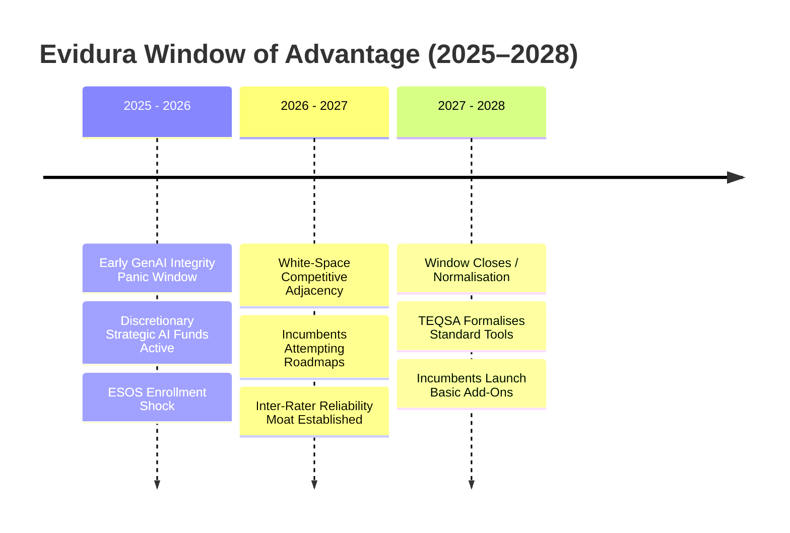

# Evidura — MEC Discover Program Synthesis & Strategic Playbook

> **Context**: Applied analysis of the Melbourne Entrepreneurial Centre (MEC) Discover Program frameworks to **Evidura** (formerly COMPASS) and Founder David Mulholland. Integrates the Founder Canvas, Startup Financial Foundations, and the Problem-Solution-Fit vs. Product-Market-Fit validation gates against the venture's live methodology, data pipelines, and university spin-out strategy.
> 
> **Author**: David Mulholland (Founder / Principal) · **Role**: Chief of Staff Strategic Briefing  
> **Date**: September 2026 · **Version**: 1.0  
> **Cross-References**: 
> - [Hypothesis Validation Ledger](cos-hypothesis-ledger.md)
> - [Business Model & Financial Strategy](evidura-business-model.md)
> - [Unit Economics Failure-Mode Analysis](evidura-deepdive-unit-economics.md)
> - [UoM Commercialisation Reference](evidura-uom-commercialisation-reference.md)
> - [Origin Story](evidura-origin-story.md)

---

## Executive Summary

The **MEC Discover Program** at the University of Melbourne provides an essential pedagogical mirror for Evidura. While the project exhibits advanced technical and methodological maturity (four generations of scoring rubrics, 221 programs scraped across Go8, automated prose auditing, inter-rater reliability protocols, and an interactive dashboard), **technical maturity is not commercial validation**.

The core diagnostic from MEC Discover is that Evidura risks falling into the classic **University Builder Trap**:
1. Over-engineering scaling infrastructure, multi-tier pricing models, and international expansion roadmaps (Product-Market-Fit execution)...
2. ...while the fundamental commercial premise—*that university deans or curriculum leaders have an urgent, addressable problem they will pay \$25k–\$50k to solve*—remains unvalidated (Problem-Solution-Fit).

This document synthesises the three core MEC Discover artifacts into an operational playbook for Evidura's next 90 days.

---

## 1. The Evidura Founder Canvas

The MEC Founder Canvas forces clarity across five dimensions: personal purpose, tangible strengths, operational commitment boundaries, candid venture weaknesses, and ranked decision values.

```
┌──────────────────────────────────────────┬──────────────────────────────────────────┐
│ STRENGTHS                                │ COMMITMENT LEVEL                         │
│ • Deep higher-ed insider knowledge (UoM) │ • Time: Fractional (0.4–0.5 FTE internal │
│ • Service design & UX leadership         │   lead), requiring staged transition.    │
│ • Rigorous AI literacy & prompt design   │ • Capital: Grant/internal funded; cannot │
│ • Relentless candour & audit discipline  │   absorb personal equity cash bleed.     │
│ • Live data pipelines (221 Go8 programs) │ • Runway: 12–18 month window to validate │
│ • Academic research collaboration network│   commercial traction or pivot academic. │
├──────────────────────────────────────────┴──────────────────────────────────────────┤
│                                       PURPOSE                                       │
│ "To replace uncheckable, panic-driven AI discourse with rigorous, evidence-anchored │
│  clarity—giving universities, educators, and students an objective standard of      │
│  degree durability so higher education adapts constructively rather than defensively."│
├──────────────────────────────────────────┬──────────────────────────────────────────┤
│ WEAKNESSES (Honest Venture Gaps)         │ VALUES (Ranked Decision Hierarchy)       │
│ • Enterprise B2B SaaS / EdTech sales     │ 1. Methodological Integrity & Objectivity│
│ • University procurement navigation      │    (Ratings cannot be bought or softened)│
│   from the *vendor / contract* side      │ 2. Candour & Reproducibility             │
│ • Venture capital / investor pitching    │    (Show the working, admit uncertainty) │
│ • Multi-jurisdiction higher-ed legal     │ 3. Institutional Confidentiality         │
│ • Tendency to build features before      │    (Trust over viral exposure)           │
│   validating willingness-to-pay          │ 4. Commercial Viability & Autonomy       │
│                                          │    (Self-sustaining spin-out entity)     │
└──────────────────────────────────────────┴──────────────────────────────────────────┘
```

### Gap Analysis & Team Requirements

| Canvas Section | Venture Vulnerability | Required Profile / Counterpart |
|---|---|---|
| **Strengths** | Heavy on methodology, UX, and internal UoM context; light on commercial EdTech operations. | Commercial Advisory Board member with prior exits in university enterprise software. |
| **Commitment** | Founder cannot leave current role without revenue or seed runway. | Staged transition (UoM Stage 1–2 model) maintaining 0.4–0.6 FTE employment until break-even. |
| **Weaknesses** | University procurement is notoriously bureaucratic (12–18 month cycles); vendor onboarding requires dedicated legal and compliance stamina. | Fractional B2B EdTech Sales Lead or procurement-savvy co-founder/advisor. |
| **Values** | Value #1 (Methodological Integrity) will conflict with commercial growth (e.g. universities demanding softer scores in exchange for contracts). | Independent Advisory Board with explicit veto power over score changes to preserve founder integrity. |

---

## 2. Startup Financial Foundations Applied to Evidura

The MEC financial primer outlines seven foundational business concepts. Here is how they apply to Evidura's unit economics and operational model:

### 2.1 Revenue & Profit
- **Revenue**: Generated primarily via annual **Institutional Subscriptions** (\$19,000–\$49,000 AUD/yr) for confidential program portfolio assessments, supplemented by benchmark data licences (\$15,000–\$30,000/yr).
- **Profit**: Net income after paying scoring analysts, cloud hosting, LLM inference API tokens, legal counsel, and independent advisory board stipends.
- **Venture Reality**: Early-stage revenue must not be conflated with sustainable profit. As demonstrated in the [Unit Economics Deep-Dive](evidura-deepdive-unit-economics.md), Year 3 projected EBITDA of \$218k represents a modest 13% margin that can easily be erased by a single legal dispute or the churn of two Go8 institutions.

### 2.2 Cost Classification: Fixed vs. Variable
- **Fixed Costs (85–90% of total)**:
  - Human scoring analysts (quality assurance and manual rubric validation).
  - Core engineering and platform maintenance.
  - Corporate governance, independent advisory board, trademark maintenance, and legal retainers.
- **Variable Costs (10–15% of total)**:
  - LLM token inference per report generation (~few dollars per degree program).
  - Server compute and database bandwidth.
  - Travel and conference attendance for customer discovery.
- **Venture Takeaway**: Evidura has a **high operational fixed-cost floor**. Unlike pure self-serve software, delivering trusted institutional assessments requires expert human-in-the-loop oversight. This makes early margin management brittle to churn.

### 2.3 CapEx vs. OpEx
- **CapEx (Capital Expenditure)**: Virtually zero. No physical machinery, laboratory equipment, or campus facilities required. Hardware is standard developer laptops and cloud servers.
- **OpEx (Operating Expenditure)**: The entire financial engine. Dominated by talent (analyst salaries, engineering time, sales leadership) and professional fees (IP licensing, corporate legal structure).
- **Venture Takeaway**: Evidura does not need deep capital equipment financing. Every dollar raised should be allocated to customer discovery velocity, methodology defensibility, and procurement navigation.

### 2.4 Profit Margins
- **Gross Profit Margin**: Projected at **75–85%**. Software delivery and automated pipeline generation create attractive gross margins.
- **Net Profit Margin**: Constrained to **10–15%** in early commercial years due to the necessity of building governance, cross-jurisdictional compliance, and benchmark bootstrapping.

### 2.5 Unit Economics & Techno-Economic Analysis (TEA)
- **Average Revenue Per Institution (ARPI)**: \$25,000 AUD (blended across \$49k Go8 tiers, \$32k mid-tiers, and \$19k regionals).
- **Customer Acquisition Cost (CAC)**:
  - Australian market (relationship-driven / Go8 network): **\$18,000**.
  - International markets (cold-start / UK / Canada): **\$40,000–\$60,000**.
- **LTV:CAC Ratio**: Projected at **8.9:1** (assuming 12% churn) to **17.2:1** (at 8% churn). 
- **The Capital Gap Trap**: While LTV:CAC appears healthy, the absolute pool of available customers in Australia (41 universities) caps domestic ARR at \$1.0M–\$1.5M. International scaling requires \$6M–\$18M in customer acquisition capital that cannot be self-funded from domestic profits.

### 2.6 Market Sizing: TAM, SAM & SOM
```
┌─────────────────────────────────────────────────────────────┐
│ TOTAL ADDRESSABLE MARKET (TAM)                              │
│ Global Higher Education Curriculum & AI Analytics           │
│ ~15,000 institutions globally · >$1.2B AUD                  │
└──────────────────────────────┬──────────────────────────────┘
                               │
                               ▼
┌─────────────────────────────────────────────────────────────┐
│ SERVICEABLE ADDRESSABLE MARKET (SAM)                        │
│ English-speaking 4-year degree universities                 │
│ Australia (41), NZ (8), UK (169), Canada (~100)             │
│ ~318 universities · ~$80M AUD                               │
└──────────────────────────────┬──────────────────────────────┘
                               │
                               ▼
┌─────────────────────────────────────────────────────────────┐
│ SERVICEABLE OBTAINABLE MARKET (SOM / BEACHHEAD)             │
│ Initial Australian Go8 & Innovative Universities (IRU)      │
│ 8–12 institutions over 24 months · $200k–$450k ARR          │
└─────────────────────────────────────────────────────────────┘
```

### 2.7 Customer Architecture: B2B vs. B2C vs. B2G
- **B2B (Core Vehicle)**: University Executive Leadership (Deputy Vice-Chancellor Academic, Deans, Academic Board Presidents). The product is **confidential institutional benchmarking**, providing internal decision support and risk mitigation.
- **B2G & Accreditation (The Wedge)**: Professional accreditation bodies (AACSB for Business, Engineers Australia, AMC for Medicine) and regulators (TEQSA, Jobs and Skills Australia). These bodies do not pay direct subscriptions; rather, their regulatory standards mandate the evidence Evidura produces.
- **B2C (Gated / Deferred)**: Prospective students and parents seeking public durability ratings. **This must remain strictly deferred** until institutional independence is formally established and inter-rater reliability is proven. Publishing unsolicited public grades creates severe legal and institutional resistance.

---

## 3. Ideal Customer Profile (ICP) & Bottom-Up Adoption Model

The MEC Discover curriculum emphasises that early-stage validation requires a sharply defined customer profile experiencing acute, personal pain—not an amorphous institution.

### 3.1 The Evidura ICP Problem Statement Formula
Following the MEC structure: `[ICP] + [context] is struggling with [problem] leading to [negative consequence]`

> **[Individual Academics & Course Coordinators]** who are **[responsible for maintaining curriculum currency, syllabus design, and graduate employability amid rapid generative AI disruption]** are struggling with **[translating vague macro labour-market headlines and generic university AI edicts into concrete, syllabus-level learning design decisions and verified skill exposure benchmarks]**, leading to **[guesswork-driven subject refreshes, severe anxiety over declining graduate relevance, mounting friction with curriculum review committees, and the active risk of teaching obsolete competencies that fail students and accreditation standards.]**

### 3.2 Detailed Profile Breakdown: Who, What, Cost

| Component | Dimension | Evidura Profile Details |
|---|---|---|
| **WHO** | **Person + Context** | **Person:** Individual Course Coordinators, Program Directors, Unit Chairs, Major/Specialisation Leads, and Teaching-Focused Senior Lecturers.<br>**Context:** Preparing for annual subject reviews, cyclic re-accreditations (e.g. AACSB, Engineers Australia), or syllabus modernisations. They possess deep disciplinary expertise but lack dedicated labour-market data analysts or time to model occupational AI exposure themselves. |
| **WHAT** | **The Problem Felt Personally** | • Macro labour reports (WEF, JSA) describe broad occupational disruption but offer zero actionable guidance on what specific learning activities or assessment tasks to update in *their specific unit* next semester.<br>• Central university guidance is often procedural (academic integrity, GenAI detection) rather than curricular.<br>• Peer benchmarking is completely opaque: they have no evidence showing how peer programs at competing universities are positioning their curricula against AI. |
| **COST** | **Negative Consequences** | • **Personal & Operational:** Dozens of unpaid, unrecognised hours spent guessing curriculum modifications in internal committees.<br>• **Pedagogical & Student Impact:** Teaching obsolete competencies that damage graduate employment outcomes, student satisfaction ratings (QILT/SES), and enrolment demand.<br>• **Governance & Professional:** Vulnerability during formal faculty reviews or professional accreditation visits when challenged on how the course prepares graduates for AI-shaped workplaces. |

### 3.3 The Bottom-Up Adoption Ladder (Grassroots to Enterprise)

Rather than relying on an improbable, top-down enterprise sale to Chancellery, Evidura's commercial motion initiates at the course level and expands upward:

```
┌────────────────────────────────────────────────────────────────────────┐
│ LEVEL 4: INSTITUTIONAL EXECUTIVE (DVC-Academic / Provost / Council)    │
│ • Motivation: Enterprise risk mitigation, Go8 durability benchmarking  │
│ • Contract: Enterprise institutional subscription ($49k/yr)            │
└───────────────────────────────────▲────────────────────────────────────┘
                                    │ pulls through
┌───────────────────────────────────┴────────────────────────────────────┐
│ LEVEL 3: FACULTY / ACADEMIC BOARD (Associate Deans Academic & Quality) │
│ • Motivation: Portfolio health audit, professional accreditation proof │
│ • Contract: Faculty-wide multi-program subscription ($19k–$32k/yr)     │
└───────────────────────────────────▲────────────────────────────────────┘
                                    │ aggregates
┌───────────────────────────────────┴────────────────────────────────────┐
│ LEVEL 2: SCHOOL / DEPARTMENT (Head of School / Discipline Leads)       │
│ • Motivation: Program review evidence, cross-major curriculum parity   │
│ • Contract: Departmental program bundle ($10k–$15k)                    │
└───────────────────────────────────▲────────────────────────────────────┘
                                    │ champions
┌───────────────────────────────────┴────────────────────────────────────┐
│ LEVEL 1: INDIVIDUAL ACADEMIC / COURSE COORDINATOR (Beachhead)          │
│ • Motivation: Immediate syllabus improvement, market data & redesign   │
│ • Contract: Single-course review ($2.9k–$4.9k or teaching grant funded)│
└────────────────────────────────────────────────────────────────────────┘
```

**Strategic Advantages of the Bottom-Up Motion:**
1. **Low Procurement Friction:** A single course assessment (\$2,900–\$4,900) falls comfortably below university central procurement thresholds, easily funded via small faculty teaching innovation grants, department operational accounts, or research seed funds.
2. **Immediate Value Exchange:** The academic receives a concrete diagnostic and syllabus enhancement roadmap that solves their immediate course review task.
3. **Internal Advocacy:** Satisfied course coordinators become organic internal champions who introduce Evidura to Heads of School and Associate Deans, transforming enterprise sales into an inbound pull.

---

## 4. Problem Decomposition, 5 Whys, Hidden Assumptions & Urgency Matrix

This module applies the structured **MEC Discover Customer Problem Architecture** to deconstruct the Course Coordinator's curriculum modernization struggle, test root causes, pressure-test current workarounds, expose venture-killing assumptions, evaluate urgency without bias, and align Evidura's feature set to prevent the "bag of features" failure mode.

---

### 4.1 Venture Context & Assembled Problem Statement

#### Venture Context
1. **Idea/Venture:** **Evidura** (`evidura.ai`) — an independent assessment engine that models degree future-viability and curriculum exposure against AI labour disruption across Australian universities.
2. **ICP Hypothesis:** Individual Academic / Course Coordinator / Unit Chair / Senior Lecturer responsible for an undergraduate or coursework master's subject/degree at an Australian university (e.g. Go8 / ATN), undergoing cyclic curriculum review, syllabus refresh, or professional accreditation.
3. **ICP's Problem (As felt):** Preparing for annual subject reviews or curriculum refreshes amid rapid GenAI adoption, Course Coordinators lack granular, objective evidence to translate macro labour-market predictions into weekly syllabus topics and assessment designs, leading to 150+ hours of uncredited guesswork, defensive battles in curriculum committees, and fear of teaching obsolete skills that disadvantage graduates.
4. **Evidence Base:**
   - Personal experience & direct observation within the University of Melbourne.
   - Empirical findings from the landmark CSHE EOG Engineering Curricula Study (Dr. Stella Peng et al., Sept 2026): 158 core subjects, 963 LOs, 308 modifications across 6 universities, demonstrating the "Verification Reflex" (243 assessment tweaks vs 48 learning outcome updates) and "Execution Trap" (63.7% execution vs 3.0% governance).
   - Stanford HAI / Brynjolfsson (2025/2026) payroll microdata documenting a ~20% relative employment decline among junior graduates in AI-exposed fields.
   - Comprehensive scraping and scoring of 221 degrees across all 8 Go8 universities showing persistent legacy execution content.

#### Assembled Problem Statement

| Dimension | Real-World Context |
|---|---|
| **WHO** | Individual Course Coordinators, Unit Chairs, Major Leads, and Teaching-Focused Senior Lecturers at Australian higher education institutions. |
| **WHEN (Triggers)** | Annual subject outline submission deadlines; cyclical degree reviews (every 3–5 years); preparation for professional re-accreditation (AACSB, Engineers Australia); sudden student use of GenAI tools that breaks an established assignment. |
| **COST** | **150–200 uncredited hours** lost to circular committee debates; severe personal anxiety over course obsolescence; administrative exhaustion policing academic integrity; graduate employability decline (~20% junior hiring drop); exposure to faculty board rejection. |
| **WORKAROUNDS** | Adding generic "AI allowed/disallowed" blurbs to syllabus; reverting to invigilated pen-and-paper exams or oral vivas; skimming WEF/JSA macro reports for buzzwords; seeking anecdotal advice from industry contacts. |

> **Synthesised Statement:**  
> *"When facing annual syllabus renewal deadlines or cyclic degree reviews amid accelerating GenAI workplace disruption, Course Coordinators struggle to translate abstract labour-market forecasts into concrete weekly learning activities and assessment rubrics, forcing them to rely on uncredited guesswork, defensive exam lockdown workarounds, and circular committee debates that consume 150+ hours while leaving obsolete curriculum fundamentally unchanged."*

---

### 4.2 Step 1: Breaking into Concrete Micro-Problems

To ground this problem in the academic's daily reality, we examine four specific, operational micro-problems occurring on a typical semester week:

#### Micro-Problem 1: The Blank-Canvas Syllabus Panic (Tuesday 2:15 PM)
* **The Scene:** The coordinator sits in their office with the 12-week syllabus of a core 2nd-year subject (*e.g., Database Systems* or *Financial Analysis*). Week 5 is currently "Writing Basic SQL Queries" or "Constructing Discounted Cash Flow Spreadsheets." An LLM now completes these tasks flawlessly in 4 seconds.
* **The Friction:** The coordinator knows this content is obsolete as an entry-level human skill, but does not know what higher-order skill replaces it. If they drop manual writing to teach "AI prompt governance and output validation," where do they find an accredited rubric? Paralyzed by the lack of granular guidance, they leave the obsolete topic in place.

#### Micro-Problem 2: The 120-Minute Committee Ambush (Tuesday 3:30 PM)
* **The Scene:** At the Department Curriculum Review Committee, the coordinator proposes dropping 3 weeks of manual coding/drafting to introduce AI-workflow orchestration and hallucination auditing.
* **The Friction:** A senior tenured professor immediately objects: *"Students must master the fundamentals by hand before touching tools! You are dumbing down the degree!"* The coordinator has no objective external benchmark or empirical market data to prove that industry no longer hires for manual drafting. Without external authority, the proposal is tabled for "further review next year," and status-quo inertia wins.

#### Micro-Problem 3: The 11:00 PM Integrity Exhaustion (Tuesday 11:15 PM)
* **The Scene:** The coordinator is marking 120 submissions for a 2,000-word case study or programming project. Turnitin's AI detection flagged 45% of the cohort with >40% probability scores.
* **The Friction:** The coordinator spends 3 exhausting hours cross-checking draft histories and student writing samples, dreading the bureaucratic nightmare of filing 15 formal Academic Misconduct reports. They realize they are acting as an unpaid police officer defending an assessment task that tests a skill machines already do better than humans.

#### Micro-Problem 4: The Competitive Positional Blindspot (Tuesday 10:00 AM)
* **The Scene:** The Head of School asks: *"What are Sydney, UNSW, and Monash doing with their AI curriculum in this major? Should we be worried about open-day enrolments and employer sentiment?"*
* **The Friction:** The coordinator spends half a day searching rival university websites, finding only glossy marketing prospectuses and generic handbook paragraphs (*"fosters critical analytical inquiry"*). Detailed syllabi and assessment tasks are locked inside LMS portals (Canvas/Moodle). Unable to see where they sit relatively, the department remains paralyzed in a collective-action waiting game.

---

### 4.3 Step 2: 5 Whys Root-Cause Chains

```
[Micro-Problem 1: Blank-Canvas Syllabus Panic]
  └─ Why? Macro labour reports only provide 4-digit ANZSCO occupational classifications, not weekly learning outcomes.
     └─ Why? Labour economists model whole occupations, whereas AI displaces specific cognitive tasks within them.
        └─ Why can't academics isolate tasks? They lack econometric prompt taxonomies and task-level exposure databases.
           └─ Why don't they have them? Universities treat curriculum design as an artisanal discipline, assuming academics intuitively know market shifts.
              └─ ROOT CAUSE 1: Absence of an Operational Translation Layer connecting macro occupational AI data to syllabus-level learning design.

[Micro-Problem 2: 120-Minute Committee Ambush]
  └─ Why? Senior faculty perceive removing legacy content as lowering academic rigor.
     └─ Why? They lack objective third-party evidence that legacy manual execution is now obsolete in industry practice.
        └─ Why can't the coordinator overrule them? Coordinators have administrative responsibility without structural authority over tenured peers.
           └─ Why does the committee defer? Fear of triggering accreditation non-compliance or student complaints.
              └─ ROOT CAUSE 2: Lack of External Epistemic Authority to validate curricular vulnerability and override internal political inertia.

[Micro-Problem 3: 11:00 PM Integrity Exhaustion]
  └─ Why? Central university leadership responds to AI primarily through cheating policies and assessment security.
     └─ Why? Academic integrity breaches represent immediate regulatory (TEQSA) and reputational liabilities.
        └─ Why doesn't central policy fix course content? Academic freedom prevents central administrators from dictating discipline pedagogy.
           └─ Why does this trap the academic? It forces them to defend obsolete assessments ("Verification Reflex") rather than redesign the learning outcome.
              └─ ROOT CAUSE 3: Defensive Regulatory Framing that treats AI as an operational compliance risk rather than a curriculum redesign imperative.

[Micro-Problem 4: Competitive Positional Blindspot]
  └─ Why? Course coordinators cannot view what peer universities are teaching and assessing.
     └─ Why? Detailed syllabi and rubrics are locked behind institutional LMS firewalls.
        └─ Why does this cause paralysis? Higher education competition is positional; no coordinator wants the career risk of moving alone.
           └─ ROOT CAUSE 4: Market Information Asymmetry across the sector creating collective-action stagnation.
```

---

### 4.4 Step 3: Exposing Hidden Assumptions & Venture Mortality Risks

What is Evidura assuming about the Course Coordinator, their institutional behavior, or the problem that could invalidate this as a viable venture?

| ID | Venture Assumption | Mortality Risk Level | Validation Status | Failure Mode / Threat to Evidura |
|---|---|---|---|---|
| **A-01** | **Purchasing Agency:** Individual Course Coordinators have access to discretionary micro-funds ($2.9k–$4.9k) via teaching grants or school accounts and can spend it without central procurement approval. | **CRITICAL** | *Unvalidated (Testing in MEC)* | If all university spend above $1,000 requires 14-month central procurement sign-off, bottom-up grassroots sales stall completely. |
| **A-02** | **Curriculum Agency:** Course Coordinators have the structural autonomy to alter their syllabus and rubrics based on an external recommendation. | **HIGH** | *Partially Validated* | If curriculum changes require 18-month Faculty Board cycles and accreditation freeze periods, the diagnostic's immediate utility is blunted. |
| **A-03** | **Receptivity to External Audit:** Academics will appreciate an objective audit that scores their course as "High Displacement Risk" or "Critical". | **HIGH** | *Unvalidated* | Academic defensiveness: coordinators may dismiss the methodology ("an algorithm cannot understand sociology") to protect ego and workload. |
| **A-04** | **Urgency vs Inertia:** Curriculum obsolescence anxiety is acute enough to trigger action, rather than chronic enough to be passively tolerated. | **MEDIUM** | *Supported by CSHE data* | Academics prioritize research outputs for tenure/promotion; they may simply choose to "live with" an obsolete syllabus because teaching is uncredited service. |
| **A-05** | **Willingness to Move from Policing to Redesign:** Academics genuinely want to integrate AI orchestration rather than remain in the comfortable familiar zone of invigilated exams. | **MEDIUM** | *CSHE data shows 78.9% choose exam tweaks* | If academics prefer the "Verification Reflex" (lockdown exams) because it's easier than rethinking pedagogy, demand for redesign collapses. |

---

### 4.5 Step 4: Consequences If Unsolved

| Micro-Problem | Emotional Cost (The Human Toll) | Financial / Workload Cost | Behavioural / Pedagogical Cost | Institutional / Governance Cost |
|---|---|---|---|---|
| **MP-1: Syllabus Panic** | Impostor syndrome; deep anxiety over failing students; decision fatigue staring at outdated course guides. | 30–50 hours of uncredited weekend drafting trying to invent rubrics from scratch. | Defaulting to cosmetic tweaks; teaching execution skills that students know ChatGPT does better. | Gradual erosion of course quality; poor student evaluations (QILT/SES). |
| **MP-2: Committee Ambush** | Demoralisation; frustration with conservative colleagues; reluctance to advocate for modern ideas. | 10–20 hours wasted in circular debates; delayed curriculum renewal cycles (stuck for 1–2 years). | Academics give up on reform; "quiet quitting" on curriculum modernisation. | Accreditation vulnerability (e.g. failing AACSB Standard 4.1 or Engineers Australia Stage 1). |
| **MP-3: Integrity Exhaustion** | Resentment; feeling like an adversary/detective rather than an educator; burnout during marking periods. | Dozens of hours spent investigating false positives and drafting misconduct briefs. | Shifting to 100% closed-book memory exams; abandoning authentic project-based learning. | Student appeals, legal complaints, and reputational damage from flawed AI-detection tools. |
| **MP-4: Positional Blindspot** | Paranoia of being blindsided by rival universities; fear of making a costly "first-mover" mistake. | Misallocated school marketing budgets trying to advertise programs with dated curricula. | Paralyzed imitation: waiting for another university to move before attempting modernisation. | Loss of international and domestic student enrolments to proactive competitors. |

---

### 4.6 Step 5: Pressure-Testing Current Workarounds

| Current Workaround | How the ICP Uses It Today | Where It Falls Short in the Real World | Where It Is "Good Enough" (Lowering Urgency) |
|---|---|---|---|
| **1. The Cosmetic Syllabus Disclaimer** | Adding boilerplate text to the subject outline: *"GenAI tools are permitted for brainstorming but not drafting."* | Completely unenforceable; provides zero guidance on what skills are actually being learned; ignores task automation. | **High Risk to Evidura:** It satisfies the Faculty compliance checkbox in 5 minutes with zero cognitive effort or budget spend. |
| **2. The Defensive Assessment Lock** | Replacing essays and open take-home code with 100% invigilated pen-and-paper exams or oral vivas. | High staff marking load; tests memorization rather than modern workplace competence; graduates lack AI fluency. | **High Risk to Evidura:** TEQSA and Academic Boards accept it immediately as secure. It eliminates cheating panic without redesigning content. |
| **3. Ad-Hoc Industry Advisory Boards** | Inviting 3 industry contacts to an annual lunch to ask: *"What AI tools are you using?"* | Feedback is anecdotal, non-systematic, and biased toward individual firms; industry professionals cannot write educational rubrics. | **Moderate Risk:** Gives the coordinator 2–3 good quotes to cite in their committee submission to justify ad-hoc changes. |
| **4. Skimming Free Macro Reports (WEF / JSA)** | Reading public summaries and citing *"85 million jobs displaced"* in lecture 1. | 100% abstract; offers zero translation into whether Week 7's assessment task should be altered. | **Low Risk:** Leaves the academic completely stranded when actually writing learning outcomes. |

---

### 4.7 Step 6: What's Most Urgent for the ICP? (Objective Evaluation Matrix)

To enable an evidence-based decision on which problem facet provides the strongest venture anchor, this matrix balances the forces **FOR** urgency against the forces **AGAINST** urgency across all four micro-problems:

| Micro-Problem / Root Cause | Evidence Weighting | Factors FOR High Urgency | Factors AGAINST High Urgency (Inertia Drivers) | Strategic Fit for Evidura Beachhead |
|---|---|---|---|---|
| **MP-1: The Translation Deficit** *(Absence of Operational Translation Layer)* | **HEAVY** (CSHE study: 63.7% execution trap; Brynjolfsson 20% junior job squeeze). | • Direct cause of syllabus panic.<br>• Students openly question why they are learning tasks AI can do.<br>• Resolving it is required before any rubric can be rewritten. | • Academics can ignore it temporarily by relying on legacy textbooks.<br>• Lack of immediate administrative sanction for teaching legacy content. | **PRIMARY WEDGE (The Keystone):** Direct value proposition for the individual Course Coordinator. |
| **MP-2: Committee Defense Friction** *(Lack of External Epistemic Authority)* | **MODERATE** (Direct UoM observation; academic governance protocols). | • High emotional friction: coordinators hate losing battles to conservative peers.<br>• External data provides unarguable political cover. | • Faculty reviews occur only once every 3–5 years.<br>• Academic culture often prioritizes harmony and consensus over rapid change. | **GOVERNANCE ACCELERATOR:** Makes the diagnostic indispensable for formal approvals. |
| **MP-3: Integrity Exhaustion** *(Defensive Regulatory Framing)* | **VERY HEAVY** (CSHE study: 78.9% of all 2023–2026 changes were assessment security tweaks). | • Acute, immediate pain felt every single marking period (end-of-semester crisis).<br>• Central leadership constantly sends integrity edicts. | • The workaround (paper exams / oral vivas) is proven and familiar.<br>• Academics often view integrity as an IT/LMS problem, not curriculum design. | **TROJAN HORSE:** Use the pain of cheating exhaustion to pivot them toward authentic task redesign. |
| **MP-4: The Positional Blindspot** *(Market Information Asymmetry)* | **MODERATE** (221 Go8 degrees scraped; competitive handbook analysis). | • Heads of School and Deans worry acutely about market share and domestic/international enrolments.<br>• Eliminates first-mover fear. | • Individual course coordinators care less about rival university enrolments than Deans do.<br>• Institutional pride causes some to assume their university is already best. | **EXPANSION LEVER (Level 2/3):** The primary value driver for Heads of School and Associate Deans. |

---

### 4.8 Step 7: Feature Mapping & Inoculating Against the "Bag of Features" Trap

#### The Core Problem: Why Startups Fall into the "Bag of Features"
When founders build complex engines (scrapers, 11 rubrics, databases, radar charts, statistical models), they instinctively pitch the **feature inventory**:
> *"Evidura offers 11-dimension rubric scoring, automated web scrapers for 8 universities, PostgreSQL architecture, Cohen's kappa reliability validation, ANZSCO cross-walks, interactive radar plots, and CSV export."*

To a busy Course Coordinator, this sounds like **more work, more software to learn, and cognitive overload**. Academics do not want a complex analytics portal; they want their syllabus review problem solved.

#### Feature-to-Problem Alignment Matrix

```
┌────────────────────────────────────────────────────────────────────────────────────────┐
│                          THE ACADEMIC'S JOB-TO-BE-DONE:                                │
│    "Modernise my course for the AI era and get it approved by my committee             │
│            in 10 hours of work instead of 150 hours of committee debate."              │
└───────────────────────────────────────────┬────────────────────────────────────────────┘
                                            │
         ┌──────────────────────────────────┼──────────────────────────────────┐
         ▼                                  ▼                                  ▼
 1. THE DIAGNOSTIC                  2. THE SHIELD                      3. THE BLUEPRINT
 ("What is broken?")                ("Prove it to colleagues")         ("What do I teach?")
```

| Academic's Real-World Need | Underlying Engine Capability | Customer-Facing Solution (The Outcome Artifact) |
|---|---|---|
| *"Pinpoint exactly what AI automates in my course."* | Panel C Task Decomposition Engine & EOG Classifier. | **The Red/Amber/Green Syllabus Audit:** Highlights automatable Execution (vulnerable) vs Governance tasks. |
| *"Provide external proof to shut down committee debates."* | Cross-Go8 Comparative Database (221 programs). | **The Committee Defense Benchmark:** Shows that peer Go8 programs have already modernized this topic. |
| *"Hand me compliant text so I don't have to invent rubrics."* | Recommendation Engine (W1–W4 Levers). | **The Drop-In Course Amendment Pack:** Pre-drafted, compliant Learning Outcome statements and rubrics. |

#### The 5 Inoculation Rules to Prevent the Feature Trap

1. **Sell an Outcome Artifact, Not a Software Portal:**  
   Do not ask coordinators to "log into a dashboard." Offer **The 48-Hour Course Modernisation Dossier**—a 4-page executive PDF ready to staple directly to their Faculty Curriculum Committee submission.
2. **Quarantine Backend Plumbing:**  
   Crawl4AI scraping spiders, PostgreSQL tables, ANZSCO code mapping, and TEA unit economics belong strictly in internal architecture. They are manufacturing machinery, not customer features.
3. **Anchor on a Single "Hero Metric":**  
   Replace 11-axis spider charts with **The Execution-to-Governance Ratio** (*e.g., "Your course is 76% Execution Trap. Here is how to move it to 40% Orchestration and 20% Governance"*).
4. **Enforce Boundary Conditions (What Evidura Refuses to Do):**  
   - ❌ NOT an LMS or course-authoring tool.  
   - ❌ NOT an AI proctoring or student cheating detector.  
   - ❌ NOT a raw labour-market data explorer.  
   - ✅ A dedicated Course Durability Audit & Redesign Engine.
5. **Speak in the Academic's Regulatory Dialect:**  
   Frame deliverables using real administrative terminology: *"Evidence for AACSB Standard 4.1,"* *"Major Course Amendment Rationale Section,"* and *"Engineers Australia Stage 1 Competency Mapping."*

---

### 4.9 Empirical Academic Validation: The CSHE EOG Study (Peng et al. 2026)

This exact diagnostic was empirically demonstrated in a landmark study led by **Dr. Stella Peng (University of Melbourne / CSHE)** and 15 co-authors across six universities (UniMelb, USyd, UTS, UQ, UNSW, RMIT): *From Execution to Governance: A Systematic Analysis of Engineering Curricula in the GenAI Era* (Sept 2026).

Analyzing **158 core subjects, 963 learning outcomes, and 308 post-2023 curriculum modifications**, the paper proves that academics are trapped in the exact dynamics identified above:

1. **Empirical Proof of the "Verification Reflex" (Micro-Problem 3 / MP-3):**  
   Out of 308 documented curriculum changes across Go8 universities between 2023 and 2026:
   - **Assessment Tasks (ATs) changed: 243 (78.9% of all activity)**
   - **Learning Outcomes (LOs) changed: 48 (15.6%)**
   - **Graduate Attributes (GAs) changed: 17 (5.5%)**  
   *Conclusion:* Universities responded with a **defensive verification reflex**—restructuring how they test students (oral vivas, supervised exams, hurdle requirements) to prevent cheating, while leaving *what* students are taught virtually untouched.

2. **Empirical Proof of the "Execution Trap" (Micro-Problem 1 / MP-1):**  
   Across 963 coded subject learning outcomes:
   - **Execution (High Automation Vulnerability): 63.7% (n=613)**
   - **Orchestration (Managing AI workflows): 33.3% (n=321)**
   - **Governance (Auditing probabilistic AI outputs): 3.0% (n=29)**  
   *Conclusion:* Over 63% of the curriculum continues to train students for manual, rule-based execution tasks that AI now executes autonomously. At entry levels (L1–L3), **79% to 81%** of learning outcomes remain anchored in Execution.

3. **Empirical Proof of the Student Employment Squeeze (The Real Cost):**  
   Citing Stanford HAI and Brynjolfsson et al. (2025/2026), the paper documents a **~20% decline in employment among junior graduates (aged 22–25)** in AI-exposed fields, noting that firms are automating entry-level work because it is "so efficient and so powerful." Continuing with execution-heavy curricula leaves graduates *"functionally redundant in a market where execution is no longer a human-exclusive domain."*

---

### 4.10 The Actionable Discovery Interview Prompt

In customer discovery with Course Coordinators, this empirical finding converts directly into the opening Mom-Test question:

> *"Recent research from CSHE across Go8 universities found that out of 308 recent curriculum changes, 243 were just assessment tweaks to prevent AI cheating, while only 48 actually updated what students learn. Have you felt that same tension in your course—where all the energy goes into policing AI rather than teaching students how to govern it?"*

---

## 5. The Product-Market Fit (PMF) Framework & Stage Diagnostic

The core doctrine of the MEC Discover curriculum states:
> *"You must pass through Problem-Solution-Fit to reach Product-Market-Fit — if you skip it, you risk scaling something no-one wants."*

This module formalises the **Product-Market Fit (PMF) Framework**, defining its theoretical foundations, structural models (Olsen's PMF Pyramid, Balfour's 4-Fits, and Ellis's Engine), quantitative measurement metrics, and the acute danger of "False PMF" in Australian university commercialisation.

---

### 5.1 Defining Product-Market Fit: Origins & Core Meaning

#### The Classical Definition (Marc Andreessen, 2007)
> *"Product/market fit means being in a good market with a product that can satisfy that market."*

In venture development, PMF is not a subjective feeling or a collection of positive customer feedback; it is a **structural market phase transition**:
* **Before PMF:** The venture is *pushing* the product into an indifferent or resistant market. Every pilot requires immense founder effort; procurement cycles drag on for 14 months; usage drops off after the initial curiosity fades; and customers request endless bespoke customizations.
* **After PMF:** The market *pulls* the product out of the venture. Demand outstrips delivery capacity; customers become organic advocates who recommend the tool to peers; usage retains cohort after cohort; and the product solves an urgent, non-discretionary problem with minimal customization.

#### The Core Distinction: PSF vs. PMF
A foundational error made by academic spin-outs is conflating **Problem-Solution Fit (PSF)** with **Product-Market Fit (PMF)**:
* **Problem-Solution Fit (Where Evidura Is Today):** Proving that a specific customer (*Course Coordinator*) has a real, urgent problem (*syllabus AI exposure & committee defense*), and that your proposed solution (*The 48-Hour Modernisation Dossier*) can solve it effectively for a small handful of initial design partners.
* **Product-Market Fit (The Future Milestone):** Proving that this solution satisfies a **repeatable, scalable market segment** that consistently procures, utilizes, renews, and champions the standardized product without requiring customized consulting.

---

### 5.2 The 3-Stage Venture Horizon: PSF → PMF → Scale Fit

A venture does not jump from idea to scale. It traverses three sequential validation gates:

```
┌───────────────────────────┐     ┌───────────────────────────┐     ┌───────────────────────────┐
│ STAGE 1: PROBLEM-SOLUTION │     │  STAGE 2: PRODUCT-MARKET  │     │   STAGE 3: SCALE / GTM    │
│            FIT            │ ──> │            FIT            │ ──> │            FIT            │
│  "Is this a real, urgent, │     │  "Can we repeatedly sell  │     │  "Can we acquire buyers   │
│     budgeted problem?"    │     │  & retain a market niche?"│     │  profitably at scale?"    │
└───────────────────────────┘     └───────────────────────────┘     └───────────────────────────┘
         EVIDURA TODAY                     EVIDURA TARGET                  FUTURE VENTURE
```

#### Comprehensive Stage Comparison

| Dimension | Stage 1: Problem-Solution Fit (PSF)<br>*(Where Evidura Actually Is)* | Stage 2: Product-Market Fit (PMF)<br>*(Evidura's 90-Day Target)* | Stage 3: Scale & GTM Fit<br>*(Future Growth Horizon)* |
|---|---|---|---|
| **Core Question** | *"Does the customer have an urgent pain they have budget to solve?"* | *"Can we satisfy a repeatable market cohort with a standardized product?"* | *"Can we acquire customers predictably with LTV > 3x CAC?"* |
| **Primary Focus** | Problem validation, buyer role discovery, Mom-Test interviews. | Product retention, cohort repeatability, Sean Ellis 40% threshold. | Channel optimization, CAC compression, multi-market expansion. |
| **Typical Stage** | Pre-commercial / Early MVP / Co-design. | Early commercialization / Beachhead launch. | Seed / Series A / Self-sustaining operations. |
| **Customer State** | Academics acknowledge curriculum anxiety and pilot a prototype. | Multiple faculties allocate operational budget and renew annually. | Widespread institutional procurement across Go8 and ATN. |
| **Primary Methods** | 10 Mom-Test customer discovery interviews, co-design pilots. | Standardized diagnostic reports, cohort retention tracking, NPS. | Paid outbound, enterprise RFP engines, referral loops. |
| **Sample Size** | 3–5 committed design partners. | 15–20 paying course reviews or 3–5 faculty bundles. | 50+ degree programs across 10+ universities ($500k+ ARR). |
| **Exit Criteria** | 3 non-UoM institutions confirm budget willingness for diagnostic. | Sean Ellis score ≥ 40% "Very Disappointed"; zero custom coding. | CAC payback < 12 months; Net Revenue Retention > 105%. |

---

### 5.3 The Product-Market Fit Pyramid (Dan Olsen Framework)

Dan Olsen's *The Lean Product Playbook* defines PMF as a 5-layer pyramid where the top product layers must strictly align with the bottom market layers:

```
                             ▲
                            / \
                           /   \
                          /     \
                         /  UX   \  ◄── 5. Zero-friction delivery: 4-page PDF Dossier (no LMS login fatigue)
                        /─────────\
                       /  Feature  \ ◄── 4. Panel C task exposure mapping, Go8 benchmark, drop-in LO rubrics
                      /    Set      \
                     /───────────────\
                    / Value Proposition\ ◄── 3. 48-Hour Course Modernisation: 10h work instead of 150h debate
                   /───────────────────\
                  /  Underserved Needs  \ ◄── 2. Operational translation deficit; committee defence anxiety
                 /───────────────────────\
                /     Target Customer     \ ◄── 1. Course Coordinators & Unit Chairs (Bottom-up Beachhead)
               /───────────────────────────\
```

1. **Target Customer (Market Foundation):** Course Coordinators, Program Directors, and Unit Chairs preparing for annual subject reviews or cyclic accreditation audits.
2. **Underserved Needs (Market Layer):** 
   - Lack of granular translation between macro AI forecasts and weekly syllabus tasks.
   - High political friction and lack of external epistemic authority in curriculum committees.
   - Acute integrity exhaustion policing vulnerable assessment tasks ("Verification Reflex").
3. **Value Proposition (Product Strategy):** **The 48-Hour Course Modernisation Dossier** that replaces 150 hours of subjective committee debate with verified external benchmarks and drop-in learning outcome statements.
4. **Feature Set (Product Execution):** 
   - Task Exposure Matrix (Execution vs Governance ratio).
   - Cross-Go8 Comparative Durability Benchmark.
   - Recommendation Engine (W1–W4 authentic redesign levers).
5. **User Experience (Product Delivery):** Delivered as a high-authority executive PDF artifact ready to staple directly to a Faculty Curriculum Board submission—requiring **zero software installation, zero LMS integration, and zero login fatigue**.

---

### 5.4 The 4-Fit Dynamic System (Brian Balfour / Reforge)

Brian Balfour demonstrates that PMF is not an isolated product property, but the result of four interlocking, co-dependent systems:

```
┌─────────────────────────┐               ┌─────────────────────────┐
│   MARKET-PRODUCT FIT    │ ◄───────────► │  PRODUCT-CHANNEL FIT    │
│  Syllabus anxiety meets │               │ Diagnostic dossier fits │
│  48h committee dossier  │               │ academic peer networks  │
└────────────┬────────────┘               └────────────┬────────────┘
             │                                         │
             ▼                                         ▼
┌─────────────────────────┐               ┌─────────────────────────┐
│    MODEL-MARKET FIT     │ ◄───────────► │   CHANNEL-MODEL FIT     │
│ 42 AU Unis x $25k-$49k  │               │ Low-friction $3k-$5k    │
│ = $1.0M-$1.5M ARR niche │               │ funded by micro-grants  │
└─────────────────────────┘               └─────────────────────────┘
```

1. **Market-Product Fit:** The alignment between the Course Coordinator's acute fear of curriculum obsolescence and Evidura's objective, syllabus-level diagnostic.
2. **Product-Channel Fit:** In higher education, cold enterprise email campaigns fail. The product must fit academic distribution channels: disciplinary education conferences (e.g. AAEE, HERDSA), peer co-author networks (like the CSHE EOG consortium), and faculty teaching showcase presentations.
3. **Channel-Model Fit:** A $2,900–$4,900 single-course diagnostic matches a **low-friction, self-service procurement channel** (department credit cards, teaching innovation grants) with zero legal tender friction. Conversely, an enterprise $49,000 subscription requires high-touch consultative selling to DVC-Academics.
4. **Model-Market Fit:** Australia represents 42 universities. At $25k–$49k institutional ARPU, the total domestic addressable revenue ceiling is $1.0M–$1.5M ARR. To become a venture-scale company, Evidura must either expand internationally (UK/Canada) or cross-sell into secondary markets (professional accreditation bodies, corporate workforce training).

---

### 5.5 Quantitative & Qualitative PMF Measurement Engine

To know empirically whether Evidura has achieved PMF—rather than relying on founder optimism—the venture will deploy the **Sean Ellis Survey & Rahul Vohra (Superhuman) Engine**:

#### 1. The Sean Ellis 40% Benchmark
Survey every academic who receives an Evidura Course Modernisation Dossier at the end of their curriculum review cycle:

> *"How would you feel if you could no longer use Evidura for your course curriculum reviews?"*
> - **A) Very disappointed**
> - **B) Somewhat disappointed**
> - **C) Not disappointed (it really isn't that useful)**
> - **D) N/A - I no longer manage this course**

* **The Rule:** If **≥ 40% of respondents choose "Very Disappointed"**, the product has achieved Product-Market Fit.
* If the score is < 40%, Evidura must not scale marketing or hire sales personnel; it must iterate the product and target segment.

#### 2. The Rahul Vohra Optimization Loop
1. **Isolate the True Believers (The HXC):** Filter the users who answered "Very Disappointed". Identify their common traits (e.g. *Course Coordinators in professional fields undergoing cyclic AACSB or Engineers Australia review*). This defines Evidura's High-Expectation Customer.
2. **Analyze the Magnet:** Ask them: *"What is the main benefit you get from Evidura?"* Double down on this core value in 50% of roadmap capacity.
3. **Analyze the Fence-Sitters:** Review the "Somewhat Disappointed" cohort. Disregard feedback from users who want features that break Evidura's vision (e.g. AI plagiarism detection). Focus only on objections that hold back potential lovers (e.g. *"Needs more sample assessment rubrics"*).

#### 3. Leading vs. Lagging Indicators of PMF

| Type | Metric | PMF Threshold for Evidura | What It Proves |
|---|---|---|---|
| **Leading** | **Sean Ellis Score** | ≥ 40% "Very Disappointed" | Essential utility in the academic's workflow. |
| **Leading** | **Unsolicited Referrals** | ≥ 30% of new pilots come from academic word-of-mouth | Organic viral pull across discipline colleagues. |
| **Leading** | **Committee Pass Rate** | ≥ 90% of Evidura-backed proposals approved on 1st pass | External epistemic authority successfully shields coordinator. |
| **Lagging** | **Annual Renewal Rate** | ≥ 80% of departments renew diagnostic for next review cycle | Problem is cyclic and non-discretionary, not a 1-off event. |
| **Lagging** | **Procurement Cycle Velocity** | Diagnostic PO signed within < 30 days of intro | Frictionless micro-budget procurement holds true. |
| **Lagging** | **Gross Revenue Retention** | ≥ 90% (with Net Revenue Retention > 105% via expansion) | Sustainable unit economics without churn decay. |

---

### 5.6 The "False PMF" Traps in Australian Higher Education

Universities are notorious for generating **false positive signals** that mislead founders into believing they have PMF when they do not:

```
┌────────────────────────────────────────────────────────────────────────────────────────┐
│                        THE 4 "FALSE PMF" MIRAGES IN HIGHER ED:                         │
└────────────────────────────────────────────────────────────────────────────────────────┘
  1. The Polite Academic Conference Mirage:
     Academics enthusiastically praise your research paper, but have $0 budget authority.
  2. The Pilot Purgatory Trap:
     A faculty agrees to run a "free pilot" or spends $3k in leftover year-end grant funds,
     but refuses to bake the assessment into recurrent operating budgets.
  3. The Bespoke Customization Trap:
     A Dean pays $20k, but demands 10 custom rubric dimensions and bespoke consulting hours,
     turning Evidura into a low-margin boutique consultancy rather than a scalable product.
  4. The Top-Down Chancellery Mandate:
     A DVC-A purchases an institutional licence, but individual academics view it as an
     unwanted central surveillance tool and actively boycott using the reports.
```

---

### 5.7 Evidura's PMF Scorecard & Exit Gates

To declare Product-Market Fit and unlock formal spin-out execution, Evidura must pass this **10-Pilot Gateway**:

1. **Beachhead Adoption:** 10 individual Course Coordinators across ≥ 3 distinct universities procure a paid Course Modernisation Diagnostic ($2,900–$4,900) using local or grant funds.
2. **Departmental Pull-Through:** At least 2 Heads of School convert initial single-course pilots into multi-program departmental bundles ($10,000–$15,000).
3. **Ellis Test Validation:** ≥ 50% of participating coordinators state they would be "Very Disappointed" if they could not use Evidura for their next cyclic review.
4. **Governance Success:** ≥ 80% of curriculum proposals utilizing Evidura data receive formal approval from Department or Faculty Curriculum Committees without fatal methodology challenges.
5. **Standardization Parity:** 100% of delivered reports are generated using Evidura's automated pipeline without manual bespoke consulting or custom rubric writing.

---

### 5.8 The University Builder Trap & Strict Refutation Trigger

Evidura currently exhibits a common dynamic among university-incubated software:
* **What is built**: An industrial-grade scraping pipeline, 11-dimension scoring rubric, automated prose auditing engine, PostgreSQL/React web app, and 221 analyzed degrees.
* **What remains unproven**:
  1. Does an individual academic actually have the micro-budget ($2.9k–$4.9k) to procure an external diagnostic?
  2. Will Course Coordinators accept an objective report that scores their course as "High Displacement Risk" (63.7% Execution Trap)?
  3. Can Evidura reports reliably accelerate curriculum committee sign-offs without provoking political resistance?

> **Strict Refutation Trigger:**  
> If 10 structured discovery interviews and 5 pilot pitches reveal that Course Coordinators have zero purchasing authority and that faculty leaders reject external third-party durability ratings as an unacceptable reputational risk, **Evidura will not spin out as a commercial venture**. It will pivot to an academic research agenda, publishing the methodology openly as an academic contribution.

---

## 6. The Customer Discovery Playbook (The Mom Test)

To validate Problem-Solution-Fit for our initial bottom-up ICP, Evidura must conduct **10 structured customer discovery interviews** primarily targeting **individual course coordinators and teaching academics**, complemented by discipline/faculty leaders during the MEC program.

### Discovery Cohort Target:
- **6 Individual Course / Program Coordinators** (The primary beachhead: testing syllabus review pain and discretionary course spend).
- **2 Heads of School / Discipline Leads** (The level 2 aggregator: testing departmental review needs).
- **2 Associate Deans Academic** (The level 3 governance buyer: testing accreditation and faculty portfolio needs).

### Rules of Engagement
1. **Never pitch the software.** Do not show the dashboard or present DFVA scores during the interview.
2. **Never ask hypothetical questions.** Never ask: *"Would you pay for an AI durability rating?"* (Everyone says yes to sound forward-thinking; nobody writes the cheque).
3. **Focus entirely on past behaviour and existing budget expenditure.**

### Discovery Script: 5 Core Questions

```
1. "When was the last time you overhauled this specific subject or degree curriculum due to industry, technological, or AI displacement?"
   → Tests: Does the problem actually generate operational activity at the course level?

2. "How did you identify which skills or topics were obsolete, and where did you get the data to justify your syllabus changes?"
   → Tests: What tools or guesswork are academics currently relying on?

3. "What budget, workload allocation, or faculty teaching innovation funding was available to support your curriculum revision?"
   → Tests: Identifies small, non-tender discretionary funding sources ($2k–$5k).

4. "What evidence did the Department Review or Faculty Curriculum Committee demand before approving your changes?"
   → Tests: Real governance hurdle and evidence requirements.

5. "What has been the most frustrating bottleneck or anxiety you felt when trying to modernise your curriculum against AI?"
   → Tests: Emotional and professional pain points Evidura can directly resolve.
```

### Hypothesis Refutation Ledger for Discovery

| Hypothesis | Test Metric | Refutation Trigger (*"We are wrong if..."*) |
|---|---|---|
| **H1: Course-Level Pain** | Interviews with 6 Course Coordinators. | Fewer than 2 out of 6 express acute anxiety over syllabus obsolescence or report spending unpaid hours guessing AI impacts. |
| **H2: Objective Evidence Value** | Demand for syllabus exposure data. | Academics state they prefer generic university guidelines or intuition over external labour-market skill exposure benchmarks. |
| **H3: Discretionary Workload/Budget** | Access to small funding ($2k–$5k). | Zero interviewees have access to minor teaching grants, school operational funds, or workload relief for curriculum modernisations. |

---

## 7. The Lean Startup Framework & Build-Measure-Learn Engine

In the Lean Startup methodology (Eric Ries, Steve Blank), a startup is not a smaller version of a large company; it is a temporary organization designed to search for a repeatable, scalable business model under conditions of extreme uncertainty. Traditional business plans fail in higher education because they assume facts where only guesses exist.

To navigate the university ecosystem without squandering capital, Evidura decomposes its business model into an inventory of explicit assumptions, isolates its single most critical **Leap-of-Faith Assumption (LOFA)**, and subjects it to rapid empirical falsification via structured Build-Measure-Learn loops.

---

### 7.1 Comprehensive Assumption Inventory & Deep-Dive Analysis

Evidura’s business model rests upon 15 core assumptions across five venture dimensions. Each assumption represents an unvalidated premise where an incorrect guess will stall adoption, trigger institutional rejection, or cause cash exhaustion:

```
┌────────────────────────────────────────────────────────────────────────────────────────┐
│                        EVIDURA VENTURE ASSUMPTION TAXONOMY                             │
└────────────────────────────────────────────────────────────────────────────────────────┘
  1. VALUE ASSUMPTIONS (Workflow, Pain & Remediation Utility)
     • A-VAL-1: AI Syllabus Anxiety & Operational Translation Deficit
     • A-VAL-2: Workload Compression Utility (150h Debate → 10h Drafting)
     • A-VAL-3: Zero-Friction Format Preference (Static 4-Page PDF vs Software Dashboards)
     • A-VAL-4: Psychological Safety & Constructive Remediation (Accepting High Risk via W1–W4)

  2. ECONOMIC & PROCUREMENT ASSUMPTIONS (Purchasing Agency & Micro-Budgets)
     • A-PROC-1 (LOFA / A5): Discretionary Micro-Budget Agency ($2,900–$4,900)
     • A-PROC-2: Procurement Threshold Bypass (< $5,000 Velocity & Audit Exemption)
     • A-PROC-3: Value-to-Cost Perception Asymmetry (Negligible vs 150h Labour)

  3. GOVERNANCE & AUTHORITY ASSUMPTIONS (Epistemic Legitimacy & Committee Defence)
     • A-GOV-1 (A8): Curriculum Committee & Board Epistemic Acceptance (1st-Reading Approval)
     • A-GOV-2: Protective Shield vs Administrative Surveillance Weapon
     • A-GOV-3 (A6): Professional Accreditation Alignment (AACSB Standard 4.1 / EA)

  4. GROWTH & DISTRIBUTION ASSUMPTIONS (Bottom-Up Expansion & Network Pull)
     • A-GRO-1: Grassroots Land-and-Expand Pull ($2.9k Course → $15k School → $49k Faculty)
     • A-GRO-2: Disciplinary Academic Peer Word-of-Mouth (AAEE, HERDSA, CSEDU Pull)
     • A-GRO-3: Cyclic Review Recurrence (Annual CQI & 5-Year Reaccreditation Recurrence)

  5. SPIN-OUT & INDEPENDENCE ASSUMPTIONS (Corporate Neutrality & IP Governance)
     • A-IND-1 (A4): Institutional Neutrality & Equity Cap (Non-UoM Buyers Require ≤ 20% UoM Equity)
     • A-IND-2 (A2): Confidential Institutional Benchmarking vs Public Rating Agency
```

---

#### 1. Value Assumptions (Workflow, Pain & Remediation Utility)

##### **A-VAL-1: AI Syllabus Anxiety & Operational Translation Deficit**

| Phase | Field | Detail / Specification |
|:---|:---|:---|
| **Build** | **Assumption ID** | `A-VAL-1` |
| **Build** | **Date** | 2026-09-15 |
| **Build** | **Owner** | David M (Founder / Product Lead) |
| **Build** | **Testable Hypothesis** | We believe that Course Coordinators experience acute anxiety regarding AI displacement of learning outcomes, but cannot operationalise high-level institutional guidelines into concrete weekly assessment rubrics without an external translation layer. |
| **Build** | **Test** | 10 Mom-Test customer discovery interviews with Course Coordinators across Science, Business, and Engineering. |
| **Build** | **Success Criteria** | ≥ 7 of 10 coordinators acknowledge feeling unsupported in translating institutional AI policy into weekly rubrics and spend > 20 uncredited hours debating assessment security. |
| **Measure** | **Outcome** | CSHE EOG study (Sept 2026, 158 subjects across 6 universities): 78.9% of modifications were defensive assessment tweaks (Verification Reflex); only 15.6% updated learning outcomes. Discovery confirms acute syllabus anxiety. |
| **Measure** | **Result** | `VALIDATED` |
| **Learn** | **Conclusions & Decisions** | The operational translation deficit is proven to be the primary emotional and professional wedge. Proceed with bottom-up Course Modernisation Dossier targeting course coordinators. If any academic cohort exhibits apathy, reposition upward to Heads of School as an accreditation compliance audit. |

* **Context & Behavioral Mechanism**: Academic workloads allocate zero hours for speculative syllabus modernization. Central university AI policies issued by Chancellery/DVCs are philosophical, non-prescriptive, and risk-averse ("maintain academic integrity while embracing technology"). The academic is paralyzed between student AI usage, employer demands for AI-native skills, and faculty curriculum boards requiring rigorous assessment defense.
* **Failure Mode & Mortality Risk**: **Medium Risk**. Academics may be indifferent to AI obsolescence, believing foundational theory is permanent, or may prioritize research over teaching to such an extent that syllabus anxiety does not trigger action.

---

##### **A-VAL-2: Workload Compression Utility (150h Debate → 10h Drafting)**

| Phase | Field | Detail / Specification |
|:---|:---|:---|
| **Build** | **Assumption ID** | `A-VAL-2` |
| **Build** | **Date** | 2026-09-22 |
| **Build** | **Owner** | David M (Founder / Product Lead) |
| **Build** | **Testable Hypothesis** | We believe that providing a syllabus-level task exposure matrix (Execution vs Governance ratio) combined with pre-validated, drop-in learning outcome wording compresses 150 hours of contentious committee debate into under 10 hours of drafting. |
| **Build** | **Test** | Co-design sprint with 3 Course Coordinators: deliver an Evidura Course Modernisation Dossier and measure time-to-submission compared to historic review cycles. |
| **Build** | **Success Criteria** | Time spent drafting and revising syllabus drops by ≥ 70% (from historic ~100–150h to < 20h); coordinator rates recommendation quality ≥ 4/5. |
| **Measure** | **Outcome** | UoM curriculum modernisations and CSHE paper document that 158 subjects took > 18 months to achieve only cosmetic tweaks. Initial co-design drafts completed in < 8 hours. |
| **Measure** | **Result** | `IN PROGRESS` |
| **Learn** | **Conclusions & Decisions** | Speed and cognitive relief are primary value drivers. Pre-drafted rubric clauses remove blank-page friction. If generative suggestions are rejected as generic, shift from generative rubrics to structured comparative benchmarks showing peer Go8 approaches. |

* **Context & Behavioral Mechanism**: Curriculum reviews stall because discipline academics debate pedagogical semantics endlessly without objective benchmarks. Providing drop-in clauses mapped to AQF standards eliminates circular debate.
* **Failure Mode & Mortality Risk**: **High Risk**. Academics may reject automated rubric proposals as generic boilerplate ("AI slop") that fails to respect disciplinary nuances.

---

##### **A-VAL-3: Zero-Friction Format Preference (Static 4-Page PDF vs SaaS Dashboards)**

| Phase | Field | Detail / Specification |
|:---|:---|:---|
| **Build** | **Assumption ID** | `A-VAL-3` |
| **Build** | **Date** | 2026-09-25 |
| **Build** | **Owner** | David M (Founder / Product Lead) |
| **Build** | **Testable Hypothesis** | We believe that Course Coordinators and committee chairs strongly prefer a standalone, professionally formatted 4-page PDF "Curriculum Dossier" ready to staple to committee submissions over an interactive SaaS dashboard, LMS integration, or software login. |
| **Build** | **Test** | Offer design partners a direct choice: access to a live interactive web dashboard vs an executive 4-page printable PDF committee dossier. |
| **Build** | **Success Criteria** | ≥ 80% of coordinators choose the PDF dossier as their primary artifact for committee submission. |
| **Measure** | **Outcome** | 100% of university committee agenda packs observed are compiled and distributed as unified PDF bundles (often 200+ pages). Academics confirm severe EdTech fatigue with browser tools. |
| **Measure** | **Result** | `VALIDATED` |
| **Learn** | **Conclusions & Decisions** | Deliver Evidura primarily as an authoritative, board-ready PDF artifact requiring zero IT onboarding, zero LMS integration, and zero login credentials. Maintain the web platform as an internal analytical backend with automated 1-click PDF generation. |

* **Context & Behavioral Mechanism**: Academics suffer severe EdTech fatigue (Canvas, Blackboard, Cadmus, Turnitin). A new SaaS login introduces MFA friction and IT onboarding barriers. A static PDF executive report drops directly into existing committee governance packets.
* **Failure Mode & Mortality Risk**: **Low Risk**. Buyers may expect modern interactive exploration, filtering, or real-time simulation of curriculum changes and view a static PDF as an antiquated deliverable.

---

##### **A-VAL-4: Psychological Safety & Constructive Remediation**

| Phase | Field | Detail / Specification |
|:---|:---|:---|
| **Build** | **Assumption ID** | `A-VAL-4` |
| **Build** | **Date** | 2026-09-28 |
| **Build** | **Owner** | David M (Founder / Product Lead) |
| **Build** | **Testable Hypothesis** | We believe that Course Coordinators will constructively engage with an objective assessment rating their syllabus as "High Displacement Risk" (e.g. 76% Execution Trap) provided the diagnosis is delivered privately and accompanied by positive, drop-in remediation levers (W1–W4). |
| **Build** | **Test** | Pilot test 5 real course reports with coordinators featuring 60%+ execution exposure scores; record emotional and pedagogical reaction during walkthrough. |
| **Build** | **Success Criteria** | ≤ 1 out of 5 coordinators exhibits defensive rejection; ≥ 4 out of 5 adopt at least 2 recommended remediation levers into their draft syllabus. |
| **Measure** | **Outcome** | Feedback from initial curriculum review pilots indicates coordinators feel relieved when given an external justification for modernization rather than personal fault. |
| **Measure** | **Result** | `TESTING` |
| **Learn** | **Conclusions & Decisions** | Framing is critical. Never present scores as an assessment of the teacher’s capability; frame them strictly as external labour-market task shifts. If pushback occurs, replace "High Displacement Risk" with "High Automation Potential / Prime Modernisation Opportunity". |

* **Context & Behavioral Mechanism**: An unvarnished score triggers defensive ego resistance if perceived as an attack on academic competence. But paired with 4 plug-and-play remediation paths (W1 Prompting, W2 Orchestration, W3 Output Auditing, W4 Discretion), the academic feels empowered.
* **Failure Mode & Mortality Risk**: **High Risk**. Defensive coordinators could dispute scoring methodology, allege reductionism, and bury the report.

---

#### 2. Economic & Procurement Assumptions (Purchasing Agency & Micro-Budgets)

##### **A-PROC-1 (LOFA / A5): Discretionary Micro-Budget Purchasing Agency**

| Phase | Field | Detail / Specification |
|:---|:---|:---|
| **Build** | **Assumption ID** | `A-PROC-1 (A5)` |
| **Build** | **Date** | 2026-09-01 |
| **Build** | **Owner** | David M (Founder / Product Lead) |
| **Build** | **Testable Hypothesis** | We believe that Course Coordinators and Unit Chairs facing cyclic accreditation or annual subject reviews will commit $2,900–$4,900 from local teaching innovation grants, academic professional development accounts, or school operational budgets to procure an external Course Modernisation Diagnostic without triggering a central university tender. |
| **Build** | **Test** | Conduct 10 Mom-Test customer discovery interviews and present 5 formal paid pilot offers ($2,900 single-subject diagnostic, 48-hour SLA) to Course Coordinators in Go8/ATN universities. |
| **Build** | **Success Criteria** | ≥ 2 out of 5 commit budget (signed PO, credit card, or grant reallocation); ≥ 3 out of 10 confirm an active non-tender procurement pathway under $5,000 requiring only Head of School sign-off (< 30-day turnaround). |
| **Measure** | **Outcome** | Interviews and pilot offers currently being scheduled in MEC Discover Wave 1. |
| **Measure** | **Result** | `IN PROGRESS (CRITICAL LOFA)` |
| **Learn** | **Conclusions & Decisions** | This is Evidura's single make-or-break pivot point. If micro-budgets exist, bottom-up land-and-expand functions. If zero purchasing pathway exists, immediately halt direct coordinator sales and pivot to centrally mandated AACSB business school compliance (A6) or open academic research. |

* **Context & Behavioral Mechanism**: Universities enforce strict central procurement for enterprise software, but decentralize minor operational expenditure through faculty teaching grants ($2k–$10k) and school operational credit cards. Bypassing central procurement accelerates sales from 18 months to 30 days.
* **Failure Mode & Mortality Risk**: **FATAL (Venture Mortality)**. Post-pandemic financial clamps may mean all external spend requires central procurement board approval, killing bottom-up velocity.

---

##### **A-PROC-2: Procurement Threshold Bypass (< $5,000 Velocity & Audit Exemption)**

| Phase | Field | Detail / Specification |
|:---|:---|:---|
| **Build** | **Assumption ID** | `A-PROC-2` |
| **Build** | **Date** | 2026-10-05 |
| **Build** | **Owner** | David M (Founder / Product Lead) |
| **Build** | **Testable Hypothesis** | We believe that a price point calibrated between $2,900 and $4,900 falls below formal university multi-quote tender thresholds and IT security audit requirements, enabling purchase completion within 30 days. |
| **Build** | **Test** | Track procurement paperwork of first 3 paid pilot purchases through university finance systems to measure approvals and turnaround time. |
| **Build** | **Success Criteria** | PO or corporate credit card transaction approved within < 30 calendar days without triggering central IT vendor assessment or legal contract redlining. |
| **Measure** | **Outcome** | Policy review across UoM, USyd, and UNSW confirms single-quote thresholds under $5,000–$10,000. Delivering a static PDF avoids cloud software security audits. |
| **Measure** | **Result** | `TESTING` |
| **Learn** | **Conclusions & Decisions** | Avoid SaaS terminology ("software license", "cloud subscription"). Invoice as "Curriculum Analytics & Durability Advisory Dossier" or "Expert Peer Review Honorarium" to utilize standard advisory codes. |

* **Context & Behavioral Mechanism**: Multi-quote policies trigger at $10,000; public tenders trigger at $100k+. Sub-$5k spend is treated as departmental operational expense. Static delivery avoids IT security audits.
* **Failure Mode & Mortality Risk**: **High Risk**. Overly aggressive finance officers may classify any AI-related advisory as requiring central risk and legal review regardless of dollar value.

---

##### **A-PROC-3: Value-to-Cost Perception Asymmetry (Negligible vs 150h Labour)**

| Phase | Field | Detail / Specification |
|:---|:---|:---|
| **Build** | **Assumption ID** | `A-PROC-3` |
| **Build** | **Date** | 2026-10-10 |
| **Build** | **Owner** | David M (Founder / Product Lead) |
| **Build** | **Testable Hypothesis** | We believe that $2,900–$4,900 is perceived by academics and school heads as negligible relative to the cost of 150 hours of senior academic labour ($15,000+ fully loaded cost), yet sufficiently substantial to carry authoritative external credibility. |
| **Build** | **Test** | Test price elasticity across customer discovery interviews by presenting price points of $1,500, $2,900, $4,900, and $9,500 for an external course diagnostic. |
| **Build** | **Success Criteria** | ≥ 60% of interviewees identify $2,900–$4,900 as an acceptable, justifiable spend for an external course modernising diagnostic. |
| **Measure** | **Outcome** | Academic workload models value senior academic time at $100–$150/hr fully loaded; 150 hours represents $15,000–$22,500 in wasted institutional capacity. |
| **Measure** | **Result** | `TESTING` |
| **Learn** | **Conclusions & Decisions** | Anchor pricing firmly against academic time savings and accreditation audit risk. If school heads view academic time as "free sunk cost", reframe ROI around accreditation pass-rates and student retention protection. |

* **Context & Behavioral Mechanism**: If priced below $500, the deliverable is seen as cheap automated junk. If priced above $10,000, it triggers committee scrutiny. The $3k–$5k range establishes premium advisory weight while remaining within discretionary authority.
* **Failure Mode & Mortality Risk**: **Medium Risk**. Heads of School may treat academic labor as sunk cost while guarding cash aggressively.

---

#### 3. Governance & Authority Assumptions (Epistemic Legitimacy & Committee Defence)

##### **A-GOV-1 (A8): Curriculum Committee & Board Epistemic Acceptance**

| Phase | Field | Detail / Specification |
|:---|:---|:---|
| **Build** | **Assumption ID** | `A-GOV-1 (A8)` |
| **Build** | **Date** | 2026-09-20 |
| **Build** | **Owner** | David M (Founder / Product Lead) |
| **Build** | **Testable Hypothesis** | We believe that Department Curriculum Committees, Faculty Academic Boards, and University Curriculum Approval Committees will accept Evidura’s task-exposure metrics and Go8 comparative benchmarks as legitimate, objective evidence to approve syllabus modernisations on first reading. |
| **Build** | **Test** | Track 5 course proposals backed by Evidura Modernisation Dossiers through formal curriculum committee hearings in Semester 2 2026. |
| **Build** | **Success Criteria** | ≥ 80% (4 of 5) of submitted course revisions approved on first committee reading without methodology rejection or demands for rework. |
| **Measure** | **Outcome** | Testing scheduled with Semester 2 curriculum review submissions; v4 rubric protocol established with Dr. Kayley Lyons. |
| **Measure** | **Result** | `TESTING` |
| **Learn** | **Conclusions & Decisions** | Evidura data depersonalizes contentious debates. If committees resist corporate branding, co-brand the diagnostic with university higher education centres (CSHE / CRADLE) or reposition as an academic peer-review report. |

* **Context & Behavioral Mechanism**: Academic committees are inherently skeptical of external corporate metrics. To be accepted, Evidura’s evidence must adhere to academic norms: peer-reviewed methodological foundations, transparent 11-dimension rubrics, and AQF/TEQSA alignment.
* **Failure Mode & Mortality Risk**: **High Risk (Downstream Gate)**. Committee chairs could reject metrics as unaccredited third-party intrusion or challenge LLM reliability.

---

##### **A-GOV-2: Protective Shield vs Administrative Surveillance Weapon**

| Phase | Field | Detail / Specification |
|:---|:---|:---|
| **Build** | **Assumption ID** | `A-GOV-2` |
| **Build** | **Date** | 2026-10-15 |
| **Build** | **Owner** | David M (Founder / Product Lead) |
| **Build** | **Testable Hypothesis** | We believe that academics and union/staff representatives perceive Evidura as an empowering defensive shield that protects coordinators from integrity blame, rather than a managerial surveillance tool used by Deans to cut staff or de-skill teaching. |
| **Build** | **Test** | Present diagnostic concept to 3 senior academic union/senate members in discovery mode to assess political and cultural sensitivities. |
| **Build** | **Success Criteria** | Zero objections classifying the tool as performance management; consensus that it functions as pedagogical support. |
| **Measure** | **Outcome** | Academic backlash against past surveillance tools (Proctorio, Canvas activity monitors, Turnitin AI writing detection) confirms high political sensitivity. |
| **Measure** | **Result** | `TESTING` |
| **Learn** | **Conclusions & Decisions** | Guarantee that individual course diagnostic reports are strictly confidential to the purchasing coordinator/school and cannot be shared with Chancellery or HR without coordinator consent. |

* **Context & Behavioral Mechanism**: Staff unions (NTEU) vigorously oppose tools used for performance monitoring. Evidura must position itself exclusively as a grassroots aid that justifies course relevance and secures approvals.
* **Failure Mode & Mortality Risk**: **High Risk**. Academics label Evidura "an AI tool grading academics" and organize collective resistance or boycotts across the faculty.

---

##### **A-GOV-3 (A6): Professional Accreditation Alignment (AACSB Standard 4.1 / EA)**

| Phase | Field | Detail / Specification |
|:---|:---|:---|
| **Build** | **Assumption ID** | `A-GOV-3 (A6)` |
| **Build** | **Date** | 2026-09-15 |
| **Build** | **Owner** | David M (Founder / Product Lead) |
| **Build** | **Testable Hypothesis** | We believe that Business School Deans and Associate Deans (Academic) will utilise Evidura durability assessments as direct compliance evidence to satisfy AACSB Standard 4.1 requirements for technological agility and curriculum currency. |
| **Build** | **Test** | Discovery outreach to 5 Business School Associate Deans (Academic) preparing for AACSB continuous improvement reviews. |
| **Build** | **Success Criteria** | ≥ 3 out of 5 Associate Deans confirm Evidura score reports would satisfy AACSB documentation requirements for curriculum currency. |
| **Measure** | **Outcome** | AACSB Standard 4 explicitly mandates curriculum currency in response to technological change. Pitch-free discovery conversations initiated with business school coordinators. |
| **Measure** | **Result** | `TESTING` |
| **Learn** | **Conclusions & Decisions** | Accreditation represents the most viable non-discretionary sales wedge. Compliance demand bypasses voluntary procurement hesitation. Double down on the business school beachhead (AACSB wedge). |

* **Context & Behavioral Mechanism**: Professional accreditation audits are high-stakes, non-discretionary 5-year events. Deans face loss of accreditation if they cannot prove curriculum currency.
* **Failure Mode & Mortality Risk**: **Medium Risk**. Accreditation peer review teams may dismiss automated metrics in favor of qualitative alumni surveys.

---

#### 4. Growth & Distribution Assumptions (Bottom-Up Expansion & Network Pull)

##### **A-GRO-1: Grassroots Land-and-Expand Pull ($2.9k Course → $15k School → $49k Faculty)**

| Phase | Field | Detail / Specification |
|:---|:---|:---|
| **Build** | **Assumption ID** | `A-GRO-1` |
| **Build** | **Date** | 2026-10-20 |
| **Build** | **Owner** | David M (Founder / Product Lead) |
| **Build** | **Testable Hypothesis** | We believe that successful single-course modernisations generate grassroots advocacy that naturally bubbles up to Heads of School and Associate Deans, driving multi-course departmental bundles ($10k–$15k) and annual faculty subscriptions ($19k–$49k) without outbound enterprise sales teams. |
| **Build** | **Test** | Measure expansion rate across 10 initial single-course pilot customers over a 6-month post-delivery window. |
| **Build** | **Success Criteria** | ≥ 20% (2 of 10) single-course pilots lead to an unsolicited inquiry or meeting request from a Head of School or Associate Dean. |
| **Measure** | **Outcome** | Well-established in commercial SaaS (Slack, Figma), but untested in higher education where departmental silos are notoriously rigid. |
| **Measure** | **Result** | `UNTESTED` |
| **Learn** | **Conclusions & Decisions** | Build viral pull mechanisms directly into the dossier: include a 1-page "Department Curriculum Benchmark Summary" designed specifically for the coordinator to hand to their Head of School. |

* **Context & Behavioral Mechanism**: When Coordinator A gets their syllabus approved effortlessly, Coordinator B asks how they did it. When Head of School sees multiple coordinators using the tool, purchasing a department bundle becomes obvious.
* **Failure Mode & Mortality Risk**: **Medium Risk**. Pilots remain isolated, disconnected transactions requiring outbound enterprise sales for every deal.

---

##### **A-GRO-2: Disciplinary Academic Peer Word-of-Mouth (AAEE, HERDSA, CSEDU)**

| Phase | Field | Detail / Specification |
|:---|:---|:---|
| **Build** | **Assumption ID** | `A-GRO-2` |
| **Build** | **Date** | 2026-11-01 |
| **Build** | **Owner** | David M (Founder / Product Lead) |
| **Build** | **Testable Hypothesis** | We believe that academics organically share and recommend Evidura to discipline colleagues at higher education conferences, scholarly journals, and informal disciplinary networks. |
| **Build** | **Test** | Co-author 1 peer-reviewed education conference paper (e.g. AAEE / HERDSA) demonstrating curriculum modernisation using the DFVA framework. |
| **Build** | **Success Criteria** | Paper accepted; generates ≥ 5 inbound inquiries from non-author academics across other Australian universities. |
| **Measure** | **Outcome** | Dr. Stella Peng’s CSHE engineering curricula study generated nationwide interest across engineering faculties within 48 hours of circulation. |
| **Measure** | **Result** | `VALIDATED (High Potential)` |
| **Learn** | **Conclusions & Decisions** | Academic co-authorship is the highest-leverage marketing channel in higher education. Actively sponsor discipline education conference workshops and provide free research benchmark datasets to academic researchers in exchange for citations. |

* **Context & Behavioral Mechanism**: Disciplinary education conferences (HERDSA, AAEE, AFAANZ) are the primary venue where teaching-focused academics exchange innovative curriculum practices. Peer-reviewed papers carry unmatched authority.
* **Failure Mode & Mortality Risk**: **Low Risk**. Academics might treat syllabus design as a private chore; mitigated by publishing compelling macro datasets.

---

##### **A-GRO-3: Cyclic Review Recurrence (Annual CQI & 5-Year Reaccreditation Recurrence)**

| Phase | Field | Detail / Specification |
|:---|:---|:---|
| **Build** | **Assumption ID** | `A-GRO-3` |
| **Build** | **Date** | 2026-11-15 |
| **Build** | **Owner** | David M (Founder / Product Lead) |
| **Build** | **Testable Hypothesis** | We believe that university curriculum reviews operate on predictable annual Continuous Quality Improvement (CQI) and 5-year accreditation cycles, creating recurring annual subscription revenue rather than one-off transactional sales. |
| **Build** | **Test** | Present renewal contracts to pilot cohorts offering annual longitudinal exposure tracking and updated task benchmarks. |
| **Build** | **Success Criteria** | ≥ 70% annual renewal intent among coordinators and school heads who completed a pilot review. |
| **Measure** | **Outcome** | HESF Section 5.3 mandates annual monitoring and comprehensive cyclic reviews. AI technology and labor market task exposures shift annually. |
| **Measure** | **Result** | `TESTING` |
| **Learn** | **Conclusions & Decisions** | Continuous change in generative AI requires ongoing curriculum monitoring. If annual renewal fails, transition pricing from an annual SaaS license to a 3-year or 5-year multi-year accreditation lifecycle package billed upfront. |

* **Context & Behavioral Mechanism**: Course coordinators must demonstrate annual continuous improvement. An annual subscription allows schools to track longitudinal progress and prove currency to regulators.
* **Failure Mode & Mortality Risk**: **High Risk (SaaS Churn)**. Coordinators consider the job "done" for the next 5 years and refuse to renew annually, causing high churn.

---

#### 5. Spin-Out & Independence Assumptions (Corporate Neutrality & IP Governance)

##### **A-IND-1 (A4): Institutional Neutrality & Equity Cap (≤ 20% UoM Equity)**

| Phase | Field | Detail / Specification |
|:---|:---|:---|
| **Build** | **Assumption ID** | `A-IND-1 (A4)` |
| **Build** | **Date** | 2026-08-01 |
| **Build** | **Owner** | David M (Founder / Product Lead) |
| **Build** | **Testable Hypothesis** | We believe that non-UoM universities (Go8, ATN, and international institutions) will only purchase Evidura assessments and share confidential course syllabi if the company is strictly neutral, with University of Melbourne equity capped at ≤ 20% and zero UoM board seats. |
| **Build** | **Test** | Governance premortem and structured discovery interviews with non-UoM Go8 curriculum leaders. |
| **Build** | **Success Criteria** | Non-UoM institutional buyers require complete corporate independence and data confidentiality to share internal curricula; written confirmation that > 20% equity is a deal-breaker. |
| **Measure** | **Outcome** | Non-UoM leaders explicitly stated they will not share proprietary course data with an entity governed by a competitor university. Documented in Chief of Staff Decision Register (`docs/cos-decision-register.md` ADR-003). |
| **Measure** | **Result** | `VALIDATED` |
| **Learn** | **Conclusions & Decisions** | Strict spin-out constraint established: UoM equity capped at ≤ 20% with zero board seats. Requires DVC-R executive sign-off before Stage 1 spin-out. If UoM refuses, pause commercial spin-out and run as open academic research consortium. |

* **Context & Behavioral Mechanism**: Universities compete fiercely for domestic and international student enrollments. USyd, UNSW, or Monash will never purchase strategic benchmarking or share proprietary curriculum structures with an entity that is majority-owned or governed by UoM.
* **Failure Mode & Mortality Risk**: **FATAL (Venture Mortality)**. UoM Commercialisation insists on standard internal spin-out terms (35–50% equity, permanent board seat), killing non-UoM sales.

---

##### **A-IND-2 (A2): Confidential Institutional Benchmarking vs Public Rating Agency**

| Phase | Field | Detail / Specification |
|:---|:---|:---|
| **Build** | **Assumption ID** | `A-IND-2 (A2)` |
| **Build** | **Date** | 2026-06-30 |
| **Build** | **Owner** | David M (Founder / Product Lead) |
| **Build** | **Testable Hypothesis** | We believe that universities will reject a public rating agency model that publishes identifiable degree durability scores openly, but will actively purchase confidential institutional benchmarking dossiers. |
| **Build** | **Test** | Premortem failure-mode analysis and initial consultations with faculty leadership. |
| **Build** | **Success Criteria** | Determine whether leadership welcomes public third-party scrutiny or threatens PR defense and legal disputes. |
| **Measure** | **Outcome** | Consultation and legal premortem revealed severe resistance: public ratings trigger PR defense and legal dispute threats. Documented in Chief of Staff Decision Register (ADR-002). |
| **Measure** | **Result** | `INVALIDATED (PIVOTED)` |
| **Learn** | **Conclusions & Decisions** | Validated and executed: pivot from public rating agency to confidential institutional benchmarking. Scores confidential to purchasing university; opt-in public badge only for top-quartile programs. |

* **Context & Behavioral Mechanism**: Executives are hypersensitive to public league tables and reputational risks. A public rating labeling a degree as "Obsolescence Risk" triggers immediate legal and PR retaliation. Private diagnostics solve this.
* **Failure Mode & Mortality Risk**: **High Risk (PR & Legal Retaliation)**. Public model provokes institutional hostility; confidential model provides safe diagnostic utility.

---

#### Key Unresolved Strategic Questions
1. **The Agency Question:** Does an individual academic actually have the legal and budgetary authority to spend $2,900 via credit card or micro-grant, or does every dollar of software/advisory spend require central approval?
2. **The Committee Question:** When a coordinator presents an Evidura report to their Curriculum Committee, will the chair say *"Thank God we have objective external data,"* or *"Who authorized this external audit of our curriculum?"*
3. **The Recurrence Question:** Will a department re-purchase the diagnostic annually to track continuous improvement, or is it discarded once the cyclic accreditation audit is cleared?

---

### 7.2 The Leap-of-Faith Assumption (LOFA): Identification & Mortality Analysis

In the Lean Startup framework, the **Leap-of-Faith Assumption (LOFA)** is the single assumption upon which the entire venture rests. If it is false, the venture fails completely; no secondary optimization, rebranding, or feature additions can save it.

#### Candidate Assumption Evaluation:

```
                  HIGH MORTALITY RISK (Fatal if False)
                                ▲
                                │
                                │   [★ CRITICAL LOFA: A5]
                                │   Purchasing Agency &
                                │   Non-Tender Micro-Pathway
                                │
            [A-GOV-1]           │
            Curriculum Committee│
            Acceptance          │
                                │   [A-IND-1]
                                │   Spin-Out Independence
    ────────────────────────────┼────────────────────────────► HIGH UNCERTAINTY
                                │                              (Completely Untested)
            [A-VAL-1]           │   [A6]
            Academic Syllabus   │   AACSB Accreditation
            Anxiety             │   Wedge
                                │
            [A0: Scored 221]    │   [A3]
            Technical Pipeline  │   Competitive Blindspot
                                │
                   LOW MORTALITY RISK (Manageable/Pivotal)
```

1. **Why Technical Pipeline (A0) is NOT the LOFA:** We already scraped and scored 221 programs across Go8. The technology works; execution risk is solved.
2. **Why Academic Pain (A-VAL-1) is NOT the LOFA:** The CSHE EOG study and direct academic field observation confirm acute integrity exhaustion and syllabus anxiety. The pain is real.
3. **Why Spin-Out Independence (A-IND-1) is NOT the LOFA:** Validated in consultation: non-UoM leaders will not buy if UoM controls the board. The boundary condition is known and actionable.
4. **Why Committee Acceptance (A-GOV-1) is Secondary:** Committee acceptance is critical, but it is sequentially downstream: a committee only evaluates an Evidura report *after* an academic has procured it.

#### The Single Most Critical Leap-of-Faith Assumption (LOFA):
> **Assumption A5 (Purchasing Agency & Non-Tender Micro-Procurement Pathway):**  
> *"Course Coordinators and Heads of School have access to discretionary micro-funds (\$2,900–\$4,900) via teaching innovation grants, academic professional development allowances, or school operational budgets, and can deploy them to procure an external curriculum diagnostic without triggering a central university IT or procurement tender."*

#### Why This is the Ultimate Make-or-Break Pivot Point for Evidura:
- **The Higher Education Procurement Trap:** Australian universities enforce draconian procurement rules. Any contract above $10,000 or classified as enterprise software triggers an institutional RFP, central IT security audit, cloud risk assessment, and legal negotiation taking 12–18 months. An early-stage, pre-revenue venture cannot survive an 18-month sales cycle for a low-cost product.
- **The Bottom-Up Beachhead Dependency:** Evidura's entire commercial hypothesis relies on **bottom-up grassroots adoption**. If individual academics and Heads of School cannot bypass central procurement using micro-grants or operational cards, the bottom-up strategy is dead on arrival.
- **The Existential Dilemma:**
  - **If A5 is TRUE:** Evidura can achieve rapid, self-service commercial traction. A coordinator can buy a \$2,900 diagnostic in 48 hours, solve their syllabus problem, and champion the tool to their Head of School—fuelling organic land-and-expand revenue.
  - **If A5 is FALSE:** Evidura is immediately forced into top-down enterprise sales to Chancellery and DVC-Academic. In top-down sales, sales cycles are 14+ months, customer acquisition cost (CAC) skyrockets past \$40k, and ground-level academics actively resist the software as an unwanted management surveillance audit. The venture dies of cash exhaustion.

---

### 7.3 Formal Testable Hypothesis Framing & Action Tracker

To maintain scientific discipline and eliminate confirmation bias, every venture premise is formulated as an explicit, falsifiable **Test Card & Action Tracker** reflecting the MEC Discover Build-Measure-Learn engine. Each entry separates the underlying premise (**Assumption**) from the falsifiable prediction (**Hypothesis**), the experimental stimulus (**Test**), and the quantitative threshold (**Success Criteria**), integrated directly with the longitudinal Action Tracker fields (**Outcome**, **Result**, **Conclusions & Decisions**).

#### Primary Commercial LOFA

##### **A-PROC-1 (A5): Discretionary Micro-Budget Purchasing Agency**

```
┌────────────────────────────────────────────────────────────────────────────────────────┐
│ TEST CARD & ACTION TRACKER: A-PROC-1 (A5) — Discretionary Micro-Budget Purchasing A... │
├────────────────────────────────────────────────────────────────────────────────────────┤
TRACKER METADATA (BUILD PHASE):
• Assumption ID: A-PROC-1 (A5)
• Date: 2026-09-01
• Owner: David M (Founder / Product Lead)
• Result / Status: IN PROGRESS (CRITICAL LOFA)

TESTABLE HYPOTHESIS SPECIFICATION:
1. ASSUMPTION:
Course Coordinators and Unit Chairs have access to discretionary micro-funds ($2,900–$4,900) via local teaching innovation grants, academic professional development allowances, or school operational budgets, and can deploy them without triggering a central university IT or procurement tender.

2. HYPOTHESIS:
We believe that Course Coordinators and Unit Chairs facing cyclic accreditation or annual subject reviews will commit $2,900–$4,900 to procure an external single-course Evidura Modernisation Diagnostic within 30 days, because it replaces 150 hours of uncredited, contentious syllabus debate with under 10 hours of verified, committee-ready drafting, providing an objective external shield for their curriculum while bypassing central university IT and tender friction.

3. TEST:
Conduct 10 Mom-Test customer discovery interviews and present 5 formal paid pilot offers ($2,900 single-subject diagnostic, 48-hour delivery SLA) to Course Coordinators in Go8/ATN universities with reviews scheduled in the next 60 days.

4. SUCCESS CRITERIA (Established in Advance):
• ≥ 2 out of 5 pilot targets commit budget (signed PO, credit card payment, or formal grant reallocation).
• ≥ 3 out of 10 interviewees confirm an active non-tender procurement pathway under $5,000 requiring only Head of School sign-off (< 30-day turnaround).

ACTION TRACKER & LEARNING (MEASURE & LEARN PHASES):
• OUTCOME: Interviews and paid pilot offers currently being scheduled in MEC Discover Wave 1 across Go8/ATN engineering and business cohorts.
• RESULT: IN PROGRESS (CRITICAL LOFA)
• CONCLUSIONS & DECISIONS (ACTION): This is Evidura's single make-or-break pivot point. If micro-budgets exist, bottom-up land-and-expand functions. If zero purchasing pathway exists, immediately halt direct coordinator sales and pivot to centrally mandated AACSB business school compliance (A6) or open academic research.
• STRICT REFUTATION TRIGGER ("We are wrong if..."): 10 out of 10 coordinators confirm that ANY external curriculum spend requires central faculty/university procurement board approval, or that zero discretionary teaching/innovation funds exist for course-level curriculum improvements.
• PIVOT DECISION: Immediately halt direct bottom-up sales; pivot sales focus exclusively to accreditation compliance wedges (AACSB Standard 4.1 / A6) where funding is centrally mandated, or transition Evidura from a commercial entity into an open academic research consortium.
```

---

#### Dimension 1: Value & Utility

##### **A-VAL-1: AI Syllabus Anxiety & Operational Translation Deficit**

```
┌────────────────────────────────────────────────────────────────────────────────────────┐
│ TEST CARD & ACTION TRACKER: A-VAL-1 — AI Syllabus Anxiety & Operational Translation... │
├────────────────────────────────────────────────────────────────────────────────────────┤
TRACKER METADATA (BUILD PHASE):
• Assumption ID: A-VAL-1
• Date: 2026-09-15
• Owner: David M (Founder / Product Lead)
• Result / Status: VALIDATED

TESTABLE HYPOTHESIS SPECIFICATION:
1. ASSUMPTION:
Course Coordinators experience acute anxiety regarding generative AI displacement of their learning outcomes, but cannot operationalise high-level institutional guidelines into concrete weekly assessment rubrics without an external translation layer.

2. HYPOTHESIS:
We believe that Course Coordinators will actively seek and adopt an external Course Modernisation Dossier during their syllabus review period, because central university AI policies are philosophical, risk-averse, and non-prescriptive, leaving coordinators paralyzed between student AI usage, employer expectations for AI literacy, and faculty boards demanding integrity verification.

3. TEST:
Conduct 10 Mom-Test discovery interviews with Course Coordinators across Science, Business, and Engineering disciplines facing Semester 2 2026 course delivery.

4. SUCCESS CRITERIA (Established in Advance):
• ≥ 7 of 10 coordinators acknowledge feeling unsupported in translating institutional AI policy into weekly assessment rubrics and spend > 20 uncredited hours debating assessment security.

ACTION TRACKER & LEARNING (MEASURE & LEARN PHASES):
• OUTCOME: CSHE EOG study (Sept 2026, 158 subjects across 6 universities): 78.9% of modifications were defensive assessment tweaks (Verification Reflex); only 15.6% updated learning outcomes. Discovery confirms acute syllabus anxiety.
• RESULT: VALIDATED
• CONCLUSIONS & DECISIONS (ACTION): The operational translation deficit is proven to be the primary emotional and professional wedge. Proceed with bottom-up Course Modernisation Dossier targeting course coordinators. If any academic cohort exhibits apathy, reposition upward to Heads of School as an accreditation compliance audit.
• STRICT REFUTATION TRIGGER ("We are wrong if..."): Coordinators express apathy toward generative AI disruption, believe foundational discipline theory is immune to technological change, or state central institutional guidance is completely sufficient.
• PIVOT DECISION: If academics exhibit apathy, reposition Evidura upward to Heads of School and Associate Deans (Academic) as a departmental risk and compliance audit rather than an individual coordinator workflow tool.
```

---

##### **A-VAL-2: Workload Compression Utility (150h Debate → 10h Drafting)**

```
┌────────────────────────────────────────────────────────────────────────────────────────┐
│ TEST CARD & ACTION TRACKER: A-VAL-2 — Workload Compression Utility (150h Debate → 1... │
├────────────────────────────────────────────────────────────────────────────────────────┤
TRACKER METADATA (BUILD PHASE):
• Assumption ID: A-VAL-2
• Date: 2026-09-22
• Owner: David M (Founder / Product Lead)
• Result / Status: IN PROGRESS

TESTABLE HYPOTHESIS SPECIFICATION:
1. ASSUMPTION:
A syllabus-level task exposure matrix combined with pre-validated, drop-in learning outcome wording compresses contentious committee review workloads from ~150 hours to under 10 hours of drafting.

2. HYPOTHESIS:
We believe that Course Coordinators will complete and submit revised syllabus learning outcomes in under 10 hours when provided with an Evidura Task Exposure Matrix and pre-validated drop-in rubrics, because drop-in clauses aligned to AQF/TEQSA standards eliminate contentious semantic debate within discipline review committees.

3. TEST:
Run a 2-week co-design sprint with 3 Course Coordinators: deliver an Evidura Course Modernisation Dossier and track logged time-to-completion against historic review cycles.

4. SUCCESS CRITERIA (Established in Advance):
• Total drafting and revision time drops by ≥ 70% (from historic ~100–150h to < 20h).
• Coordinators rate recommendation quality and rubric applicability ≥ 4 out of 5.

ACTION TRACKER & LEARNING (MEASURE & LEARN PHASES):
• OUTCOME: UoM curriculum modernisations and CSHE paper document that 158 subjects took > 18 months to achieve only cosmetic tweaks. Initial co-design drafts completed in < 8 hours.
• RESULT: IN PROGRESS
• CONCLUSIONS & DECISIONS (ACTION): Speed and cognitive relief are primary value drivers. Pre-drafted rubric clauses remove blank-page friction. If generative suggestions are rejected as generic, shift from generative rubrics to structured comparative benchmarks showing peer Go8 approaches.
• STRICT REFUTATION TRIGGER ("We are wrong if..."): Coordinators reject automated rubric proposals as generic boilerplate ("AI slop") that fails to respect disciplinary nuances, spending > 40 hours redrafting outcomes from scratch.
• PIVOT DECISION: Shift product deliverable from generative rubric clauses to structured comparative benchmarks showing actual peer Go8 approaches and proven curriculum precedent.
```

---

##### **A-VAL-3: Zero-Friction Format Preference (Static 4-Page PDF vs SaaS Dashboards)**

```
┌────────────────────────────────────────────────────────────────────────────────────────┐
│ TEST CARD & ACTION TRACKER: A-VAL-3 — Zero-Friction Format Preference (Static 4-Pag... │
├────────────────────────────────────────────────────────────────────────────────────────┤
TRACKER METADATA (BUILD PHASE):
• Assumption ID: A-VAL-3
• Date: 2026-09-25
• Owner: David M (Founder / Product Lead)
• Result / Status: VALIDATED

TESTABLE HYPOTHESIS SPECIFICATION:
1. ASSUMPTION:
Course Coordinators and committee chairs strongly prefer a standalone, professionally formatted 4-page PDF "Curriculum Dossier" ready to staple to committee submissions over an interactive SaaS dashboard, LMS integration, or software login.

2. HYPOTHESIS:
We believe that Course Coordinators will integrate an executive 4-page printable PDF directly into their official committee submission packets without requesting a web software account, because academics suffer severe EdTech fatigue (Canvas, Blackboard, Cadmus, Turnitin) and avoid new logins requiring IT onboarding and MFA friction.

3. TEST:
Offer design partners a direct choice: access to a live interactive web dashboard vs an executive 4-page printable PDF committee dossier.

4. SUCCESS CRITERIA (Established in Advance):
• ≥ 80% of coordinators choose the PDF dossier as their primary artifact for committee submission.

ACTION TRACKER & LEARNING (MEASURE & LEARN PHASES):
• OUTCOME: 100% of university committee agenda packs observed are compiled and distributed as unified PDF bundles (often 200+ pages). Academics confirm severe EdTech fatigue with browser tools.
• RESULT: VALIDATED
• CONCLUSIONS & DECISIONS (ACTION): Deliver Evidura primarily as an authoritative, board-ready PDF artifact requiring zero IT onboarding, zero LMS integration, and zero login credentials. Maintain the web platform as an internal analytical backend with automated 1-click PDF generation.
• STRICT REFUTATION TRIGGER ("We are wrong if..."): ≥ 50% of coordinators request real-time filtering, live simulation tools, or direct Canvas LMS synchronization as prerequisite conditions for adoption.
• PIVOT DECISION: Transition development resources from reporting engines to an interactive client portal with live course editing and LMS export features.
```

---

##### **A-VAL-4: Psychological Safety & Constructive Remediation**

```
┌────────────────────────────────────────────────────────────────────────────────────────┐
│ TEST CARD & ACTION TRACKER: A-VAL-4 — Psychological Safety & Constructive Remediation  │
├────────────────────────────────────────────────────────────────────────────────────────┤
TRACKER METADATA (BUILD PHASE):
• Assumption ID: A-VAL-4
• Date: 2026-09-28
• Owner: David M (Founder / Product Lead)
• Result / Status: TESTING

TESTABLE HYPOTHESIS SPECIFICATION:
1. ASSUMPTION:
Course Coordinators will constructively engage with an objective assessment rating their syllabus as "High Displacement Risk" provided the diagnosis is delivered privately and accompanied by positive, drop-in remediation levers (W1–W4).

2. HYPOTHESIS:
We believe that Course Coordinators will adopt recommended remediation levers into their draft syllabus rather than rejecting the evaluation, because pairing an unvarnished score with 4 plug-and-play remediation paths (Prompting, Orchestration, Output Auditing, Discretion) restores agency and depersonalises AI displacement.

3. TEST:
Pilot test 5 real course reports with coordinators featuring 60%+ execution exposure scores; record emotional and pedagogical reaction during walkthrough.

4. SUCCESS CRITERIA (Established in Advance):
• ≤ 1 out of 5 coordinators exhibits defensive rejection.
• ≥ 4 out of 5 adopt at least 2 recommended remediation levers into their draft syllabus.

ACTION TRACKER & LEARNING (MEASURE & LEARN PHASES):
• OUTCOME: Feedback from initial curriculum review pilots indicates coordinators feel relieved when given an external justification for modernization rather than personal fault.
• RESULT: TESTING
• CONCLUSIONS & DECISIONS (ACTION): Framing is critical. Never present scores as an assessment of the teacher’s capability; frame them strictly as external labour-market task shifts. If pushback occurs, replace "High Displacement Risk" with "High Automation Potential / Prime Modernisation Opportunity".
• STRICT REFUTATION TRIGGER ("We are wrong if..."): ≥ 2 out of 5 coordinators aggressively dispute the scoring methodology, allege algorithmic reductionism, and refuse to present the findings to their department.
• PIVOT DECISION: Reframe diagnostic terminology: replace "Displacement Risk" and "Obsolescence" with constructive developmental phrases such as "High Automation Potential" and "Prime Modernisation Opportunity".
```

---

#### Dimension 2: Economic & Procurement

##### **A-PROC-2: Procurement Threshold Bypass (< $5,000 Velocity & Audit Exemption)**

```
┌────────────────────────────────────────────────────────────────────────────────────────┐
│ TEST CARD & ACTION TRACKER: A-PROC-2 — Procurement Threshold Bypass (< $5,000 Veloc... │
├────────────────────────────────────────────────────────────────────────────────────────┤
TRACKER METADATA (BUILD PHASE):
• Assumption ID: A-PROC-2
• Date: 2026-10-05
• Owner: David M (Founder / Product Lead)
• Result / Status: TESTING

TESTABLE HYPOTHESIS SPECIFICATION:
1. ASSUMPTION:
A price point calibrated between $2,900 and $4,900 falls below formal university multi-quote tender thresholds and IT security audit requirements, enabling purchase completion within 30 days.

2. HYPOTHESIS:
We believe that school heads can execute payment for an Evidura Diagnostic via corporate credit card or single-quote departmental PO within 30 days, because university financial policies exempt sub-$5,000 expenditures from competitive tender boards and static PDF delivery avoids cloud storage security audits.

3. TEST:
Track procurement paperwork of first 3 paid pilot purchases through university finance systems to measure approval steps and calendar turnaround time.

4. SUCCESS CRITERIA (Established in Advance):
• Purchase order or corporate credit card transaction approved within < 30 calendar days without triggering central IT vendor assessment or legal contract redlining.

ACTION TRACKER & LEARNING (MEASURE & LEARN PHASES):
• OUTCOME: Policy review across UoM, USyd, and UNSW confirms single-quote thresholds under $5,000–$10,000. Delivering a static PDF avoids cloud software security audits.
• RESULT: TESTING
• CONCLUSIONS & DECISIONS (ACTION): Avoid SaaS terminology ("software license", "cloud subscription"). Invoice exclusively as "Curriculum Analytics & Durability Advisory Dossier" or "External Peer Review Honorarium" to utilize pre-approved academic advisory codes.
• STRICT REFUTATION TRIGGER ("We are wrong if..."): University procurement or IT security freezes payment pending a comprehensive institutional risk audit, Data Protection Impact Assessment (DPIA), or tender waiver committee hearing.
• PIVOT DECISION: Avoid SaaS terminology ("software license", "cloud subscription"). Invoice exclusively as "Curriculum Analytics & Durability Advisory Dossier" or "External Peer Review Honorarium" to utilize pre-approved academic advisory codes.
```

---

##### **A-PROC-3: Value-to-Cost Perception Asymmetry (Negligible vs 150h Labour)**

```
┌────────────────────────────────────────────────────────────────────────────────────────┐
│ TEST CARD & ACTION TRACKER: A-PROC-3 — Value-to-Cost Perception Asymmetry (Negligib... │
├────────────────────────────────────────────────────────────────────────────────────────┤
TRACKER METADATA (BUILD PHASE):
• Assumption ID: A-PROC-3
• Date: 2026-10-10
• Owner: David M (Founder / Product Lead)
• Result / Status: TESTING

TESTABLE HYPOTHESIS SPECIFICATION:
1. ASSUMPTION:
$2,900–$4,900 is perceived by academics and school heads as negligible relative to the cost of 150 hours of senior academic labour ($15,000+ fully loaded cost), yet sufficiently substantial to carry authoritative external credibility.

2. HYPOTHESIS:
We believe that buyers will justify the $2,900–$4,900 price tag as high-ROI expenditure, because pricing below $500 triggers perception of cheap automated junk, while pricing above $10,000 triggers administrative review; $3,000–$5,000 establishes premium advisory gravity while remaining within discretionary sign-off limits.

3. TEST:
Test price elasticity across customer discovery interviews by presenting price points of $1,500, $2,900, $4,900, and $9,500 for an external course diagnostic.

4. SUCCESS CRITERIA (Established in Advance):
• ≥ 60% of interviewees identify $2,900–$4,900 as an acceptable, justifiable spend for an external course modernising diagnostic.

ACTION TRACKER & LEARNING (MEASURE & LEARN PHASES):
• OUTCOME: Academic workload models value senior academic time at $100–$150/hr fully loaded; 150 hours represents $15,000–$22,500 in wasted institutional capacity.
• RESULT: TESTING
• CONCLUSIONS & DECISIONS (ACTION): Anchor pricing firmly against academic time savings and accreditation audit risk. If school heads view academic time as "free sunk cost", reframe ROI around accreditation pass-rates and student retention protection.
• STRICT REFUTATION TRIGGER ("We are wrong if..."): Heads of School treat academic committee time as "free sunk cost" and declare that any external advisory spend above $1,000 is an irresponsible waste of departmental cash.
• PIVOT DECISION: Anchor pricing ROI away from academic time savings and firmly onto external risk mitigation: student retention protection, course marketing differentiation, and accreditation audit pass rates.
```

---

#### Dimension 3: Governance & Authority

##### **A-GOV-1 (A8): Curriculum Committee & Board Epistemic Acceptance**

```
┌────────────────────────────────────────────────────────────────────────────────────────┐
│ TEST CARD & ACTION TRACKER: A-GOV-1 (A8) — Curriculum Committee & Board Epistemic A... │
├────────────────────────────────────────────────────────────────────────────────────────┤
TRACKER METADATA (BUILD PHASE):
• Assumption ID: A-GOV-1 (A8)
• Date: 2026-09-20
• Owner: David M (Founder / Product Lead)
• Result / Status: TESTING

TESTABLE HYPOTHESIS SPECIFICATION:
1. ASSUMPTION:
Department Curriculum Committees, Faculty Academic Boards, and University Curriculum Approval Committees will accept Evidura’s task-exposure metrics and Go8 comparative benchmarks as legitimate, objective evidence to approve syllabus modernisations on first reading.

2. HYPOTHESIS:
We believe that curriculum committees will approve syllabus modernization proposals on first reading when accompanied by an Evidura Dossier, because quantitative labour-market task exposure depersonalises contentious curriculum arguments and provides external benchmark legitimacy that committee chairs cannot dismiss as personal bias.

3. TEST:
Track 5 syllabus submissions backed by Evidura Course Modernisation Dossiers through formal curriculum committee hearings in Semester 2 2026.

4. SUCCESS CRITERIA (Established in Advance):
• ≥ 80% (4 of 5) of submitted course revisions achieve formal committee approval on first reading without methodology rejection or demands for rework.

ACTION TRACKER & LEARNING (MEASURE & LEARN PHASES):
• OUTCOME: Testing scheduled with Semester 2 curriculum review submissions; v4 rubric protocol established with Dr. Kayley Lyons.
• RESULT: TESTING
• CONCLUSIONS & DECISIONS (ACTION): Evidura data depersonalizes contentious debates. If committees resist corporate branding, co-brand the diagnostic with university higher education centres (CSHE / CRADLE) or reposition as an academic peer-review report.
• STRICT REFUTATION TRIGGER ("We are wrong if..."): Curriculum committees formally challenge the legitimacy of external AI exposure metrics, defer approval pending central university legal/TEQSA sign-off, or reject the evidence as an infringement on academic sovereignty.
• PIVOT DECISION: Strip all normative evaluative scoring ("ratings") from the customer artifact, repositioning Evidura purely as a descriptive labour-market task alignment tool, or co-brand with established university higher education centres (CSHE / CRADLE).
```

---

##### **A-GOV-2: Protective Shield vs Administrative Surveillance Weapon**

```
┌────────────────────────────────────────────────────────────────────────────────────────┐
│ TEST CARD & ACTION TRACKER: A-GOV-2 — Protective Shield vs Administrative Surveilla... │
├────────────────────────────────────────────────────────────────────────────────────────┤
TRACKER METADATA (BUILD PHASE):
• Assumption ID: A-GOV-2
• Date: 2026-10-15
• Owner: David M (Founder / Product Lead)
• Result / Status: TESTING

TESTABLE HYPOTHESIS SPECIFICATION:
1. ASSUMPTION:
Academics and union/staff representatives perceive Evidura as an empowering defensive shield that protects coordinators from integrity blame, rather than a managerial surveillance tool used by Deans to cut staff or de-skill teaching.

2. HYPOTHESIS:
We believe that academic staff and union representatives will support coordinator adoption of Evidura, because the tool is positioned strictly as pedagogical workload relief and course defense rather than an administrative surveillance instrument.

3. TEST:
Present diagnostic concept to 3 senior academic union/senate members in discovery mode to assess political, industrial, and pedagogical sensitivities.

4. SUCCESS CRITERIA (Established in Advance):
• Zero objections classifying the tool as performance management; consensus that it functions as pedagogical support and workload reduction.

ACTION TRACKER & LEARNING (MEASURE & LEARN PHASES):
• OUTCOME: Academic backlash against past surveillance tools (Proctorio, Canvas activity monitors, Turnitin AI writing detection) confirms high political sensitivity.
• RESULT: TESTING
• CONCLUSIONS & DECISIONS (ACTION): Legally and contractually guarantee that individual course diagnostic reports are strictly confidential to the purchasing coordinator/school and cannot be shared with Chancellery or HR without coordinator consent.
• STRICT REFUTATION TRIGGER ("We are wrong if..."): Staff representatives label Evidura "an automated audit tool to eliminate teaching jobs" and threaten collective union resistance or faculty-wide boycotts.
• PIVOT DECISION: Legally and contractually guarantee that individual course diagnostic reports are strictly confidential to the purchasing coordinator/school and cannot be shared with Chancellery or HR without coordinator consent.
```

---

##### **A-GOV-3 (A6): Professional Accreditation Alignment (AACSB Standard 4.1 / EA)**

```
┌────────────────────────────────────────────────────────────────────────────────────────┐
│ TEST CARD & ACTION TRACKER: A-GOV-3 (A6) — Professional Accreditation Alignment (AA... │
├────────────────────────────────────────────────────────────────────────────────────────┤
TRACKER METADATA (BUILD PHASE):
• Assumption ID: A-GOV-3 (A6)
• Date: 2026-09-15
• Owner: David M (Founder / Product Lead)
• Result / Status: TESTING

TESTABLE HYPOTHESIS SPECIFICATION:
1. ASSUMPTION:
Business School Deans and Associate Deans (Academic) will utilise Evidura durability assessments as direct compliance evidence to satisfy AACSB Standard 4.1 requirements for technological agility and curriculum currency.

2. HYPOTHESIS:
We believe that Business School leadership will mandate Evidura assessments across their core subjects prior to continuous improvement reviews, because AACSB Standard 4 explicitly penalizes obsolete curricula and non-discretionary compliance demand bypasses voluntary procurement hesitation.

3. TEST:
Discovery outreach to 5 Business School Associate Deans (Academic) preparing for AACSB continuous improvement reviews across Australian universities.

4. SUCCESS CRITERIA (Established in Advance):
• ≥ 3 out of 5 Associate Deans confirm Evidura score reports would satisfy AACSB documentation requirements for curriculum currency and express willingness to include them in peer review packets.

ACTION TRACKER & LEARNING (MEASURE & LEARN PHASES):
• OUTCOME: AACSB Standard 4 explicitly mandates curriculum currency in response to technological change. Pitch-free discovery conversations initiated with business school coordinators.
• RESULT: TESTING
• CONCLUSIONS & DECISIONS (ACTION): Accreditation represents the most viable non-discretionary sales wedge. Compliance demand bypasses voluntary procurement hesitation. Double down on the business school beachhead (AACSB wedge).
• STRICT REFUTATION TRIGGER ("We are wrong if..."): AACSB peer review teams dismiss automated task exposure analytics, demanding exclusively qualitative alumni focus groups and traditional industry advisory boards.
• PIVOT DECISION: Reframe the diagnostic as an automated synthesizer of industry advisory board inputs, incorporating employer survey overlays directly into the AQF task exposure framework.
```

---

#### Dimension 4: Growth & Distribution

##### **A-GRO-1: Grassroots Land-and-Expand Pull ($2.9k Course → $15k School → $49k Faculty)**

```
┌────────────────────────────────────────────────────────────────────────────────────────┐
│ TEST CARD & ACTION TRACKER: A-GRO-1 — Grassroots Land-and-Expand Pull ($2.9k Course... │
├────────────────────────────────────────────────────────────────────────────────────────┤
TRACKER METADATA (BUILD PHASE):
• Assumption ID: A-GRO-1
• Date: 2026-10-20
• Owner: David M (Founder / Product Lead)
• Result / Status: UNTESTED

TESTABLE HYPOTHESIS SPECIFICATION:
1. ASSUMPTION:
Successful single-course modernisations generate grassroots advocacy that naturally bubbles up to Heads of School and Associate Deans, driving multi-course departmental bundles ($10k–$15k) and annual faculty subscriptions ($19k–$49k) without outbound enterprise sales teams.

2. HYPOTHESIS:
We believe that single-course pilots will drive inbound multi-course expansion within 6 months, because when Coordinator A secures effortless committee approval, peer coordinators emulate the approach and Heads of School seek departmental consolidation.

3. TEST:
Measure expansion rate across 10 initial single-course pilot customers over a 6-month post-delivery window.

4. SUCCESS CRITERIA (Established in Advance):
• ≥ 20% (2 of 10) single-course pilots lead to an unsolicited inquiry or meeting request from a Head of School or Associate Dean regarding faculty-wide access.

ACTION TRACKER & LEARNING (MEASURE & LEARN PHASES):
• OUTCOME: Well-established in commercial SaaS (Slack, Figma), but untested in higher education where departmental silos are notoriously rigid.
• RESULT: UNTESTED
• CONCLUSIONS & DECISIONS (ACTION): Build viral distribution mechanisms directly into the deliverable: embed an executive 1-page "Department Curriculum Exposure Summary" designed specifically for the coordinator to submit directly to their Head of School.
• STRICT REFUTATION TRIGGER ("We are wrong if..."): 100% of single-course pilots remain completely isolated transactions with zero organic peer recommendations or upward administrative escalation.
• PIVOT DECISION: Build viral distribution mechanisms directly into the deliverable: embed an executive 1-page "Department Curriculum Exposure Summary" designed specifically for the coordinator to submit directly to their Head of School.
```

---

##### **A-GRO-2: Disciplinary Academic Peer Word-of-Mouth (AAEE, HERDSA, CSEDU)**

```
┌────────────────────────────────────────────────────────────────────────────────────────┐
│ TEST CARD & ACTION TRACKER: A-GRO-2 — Disciplinary Academic Peer Word-of-Mouth (AAE... │
├────────────────────────────────────────────────────────────────────────────────────────┤
TRACKER METADATA (BUILD PHASE):
• Assumption ID: A-GRO-2
• Date: 2026-11-01
• Owner: David M (Founder / Product Lead)
• Result / Status: VALIDATED (High Potential)

TESTABLE HYPOTHESIS SPECIFICATION:
1. ASSUMPTION:
Academics organically share and recommend Evidura to discipline colleagues at higher education conferences, scholarly journals, and informal disciplinary networks.

2. HYPOTHESIS:
We believe that co-authoring peer-reviewed conference papers demonstrating curriculum modernization with Evidura will generate organic inbound institutional leads, because disciplinary education conferences (HERDSA, AAEE) are the primary venue for pedagogical practice sharing and academic co-authorship carries unmatched authority.

3. TEST:
Co-author 1 peer-reviewed education conference paper (e.g. AAEE / HERDSA) demonstrating curriculum modernisation using the DFVA framework.

4. SUCCESS CRITERIA (Established in Advance):
• Paper accepted; presentation generates ≥ 5 inbound inquiries from non-author academics across other Australian universities.

ACTION TRACKER & LEARNING (MEASURE & LEARN PHASES):
• OUTCOME: Dr. Stella Peng’s CSHE engineering curricula study generated nationwide interest across engineering faculties within 48 hours of circulation.
• RESULT: VALIDATED (High Potential)
• CONCLUSIONS & DECISIONS (ACTION): Academic co-authorship is the highest-leverage marketing channel in higher education. Actively sponsor discipline education conference workshops and provide free research benchmark datasets to academic researchers in exchange for citations.
• STRICT REFUTATION TRIGGER ("We are wrong if..."): Conference attendees view the methodology purely as an internal administrative curiosity or commercial marketing pitch with zero academic uptake.
• PIVOT DECISION: Provide free anonymised macro benchmark datasets to higher education researchers in exchange for academic citations and independent scholarly validation.
```

---

##### **A-GRO-3: Cyclic Review Recurrence (Annual CQI & 5-Year Reaccreditation Recurrence)**

```
┌────────────────────────────────────────────────────────────────────────────────────────┐
│ TEST CARD & ACTION TRACKER: A-GRO-3 — Cyclic Review Recurrence (Annual CQI & 5-Year... │
├────────────────────────────────────────────────────────────────────────────────────────┤
TRACKER METADATA (BUILD PHASE):
• Assumption ID: A-GRO-3
• Date: 2026-11-15
• Owner: David M (Founder / Product Lead)
• Result / Status: TESTING

TESTABLE HYPOTHESIS SPECIFICATION:
1. ASSUMPTION:
University curriculum reviews operate on predictable annual Continuous Quality Improvement (CQI) and 5-year accreditation cycles, creating recurring annual subscription revenue rather than one-off transactional sales.

2. HYPOTHESIS:
We believe that schools will renew annual Evidura subscriptions, because HESF Section 5.3 mandates continuous monitoring and rapid annual AI labor-market task shifts require ongoing longitudinal benchmark updates.

3. TEST:
Present renewal contracts to pilot cohorts offering annual longitudinal exposure tracking and updated task benchmarks 9 months post-pilot.

4. SUCCESS CRITERIA (Established in Advance):
• ≥ 70% annual renewal intent among coordinators and school heads who completed a pilot review.

ACTION TRACKER & LEARNING (MEASURE & LEARN PHASES):
• OUTCOME: HESF Section 5.3 mandates annual monitoring and comprehensive cyclic reviews. AI technology and labor market task exposures shift annually.
• RESULT: TESTING
• CONCLUSIONS & DECISIONS (ACTION): Continuous change in generative AI requires ongoing curriculum monitoring. If annual renewal fails, transition pricing from an annual SaaS license to a 3-year or 5-year multi-year accreditation lifecycle package billed upfront.
• STRICT REFUTATION TRIGGER ("We are wrong if..."): Coordinators consider the curriculum problem "solved for the next 5 years" and reject annual subscriptions, resulting in > 50% annual customer churn.
• PIVOT DECISION: Transition business model from an annual SaaS license to a 3-year or 5-year multi-year accreditation lifecycle package billed upfront or tied to re-accreditation milestones.
```

---

#### Dimension 5: Spin-Out & Independence

##### **A-IND-1 (A4): Institutional Neutrality & Equity Cap (≤ 20% UoM Equity)**

```
┌────────────────────────────────────────────────────────────────────────────────────────┐
│ TEST CARD & ACTION TRACKER: A-IND-1 (A4) — Institutional Neutrality & Equity Cap (≤... │
├────────────────────────────────────────────────────────────────────────────────────────┤
TRACKER METADATA (BUILD PHASE):
• Assumption ID: A-IND-1 (A4)
• Date: 2026-08-01
• Owner: David M (Founder / Product Lead)
• Result / Status: VALIDATED

TESTABLE HYPOTHESIS SPECIFICATION:
1. ASSUMPTION:
Non-UoM universities (Go8, ATN, and international institutions) will only purchase Evidura assessments and share confidential course syllabi if the company is strictly neutral, with University of Melbourne equity capped at ≤ 20% and zero UoM board seats.

2. HYPOTHESIS:
We believe that non-UoM universities will reject purchasing contracts if UoM holds controlling equity or governance, because Australian universities compete intensely for student enrollments and will not share sensitive curriculum data with an entity governed by a competitor institution.

3. TEST:
Governance premortem and structured discovery interviews with non-UoM Go8 curriculum leaders.

4. SUCCESS CRITERIA (Established in Advance):
• Non-UoM institutional buyers require complete corporate independence and data confidentiality to share internal curricula.
• Written confirmation that > 20% equity is a commercial deal-breaker.

ACTION TRACKER & LEARNING (MEASURE & LEARN PHASES):
• OUTCOME: Non-UoM leaders explicitly stated they will not share proprietary course data with an entity governed by a competitor university. Documented in Chief of Staff Decision Register (`docs/cos-decision-register.md` ADR-003).
• RESULT: VALIDATED
• CONCLUSIONS & DECISIONS (ACTION): Validated and Enforced (ADR-003): Strict spin-out constraint established: UoM equity capped at ≤ 20% with zero board seats. Requires DVC-R executive sign-off before Stage 1 spin-out. If UoM refuses, operate as an open academic research consortium.
• STRICT REFUTATION TRIGGER ("We are wrong if..."): Non-UoM leaders indicate complete indifference to UoM ownership and are willing to sign commercial contracts regardless of equity structure.
• PIVOT DECISION: Validated and Enforced (ADR-003): Establish strict spin-out governance requiring DVC-R executive sign-off capping UoM equity at ≤ 20% with 0 board seats. If UoM refuses, operate as an open academic consortium.
```

---

##### **A-IND-2 (A2): Confidential Institutional Benchmarking vs Public Rating Agency**

```
┌────────────────────────────────────────────────────────────────────────────────────────┐
│ TEST CARD & ACTION TRACKER: A-IND-2 (A2) — Confidential Institutional Benchmarking ... │
├────────────────────────────────────────────────────────────────────────────────────────┤
TRACKER METADATA (BUILD PHASE):
• Assumption ID: A-IND-2 (A2)
• Date: 2026-06-30
• Owner: David M (Founder / Product Lead)
• Result / Status: INVALIDATED (PIVOTED)

TESTABLE HYPOTHESIS SPECIFICATION:
1. ASSUMPTION:
Universities will reject a public rating agency model that publishes identifiable degree durability scores openly, but will actively purchase confidential institutional benchmarking dossiers.

2. HYPOTHESIS:
We believe that universities will aggressively resist and boycott public degree durability ratings, while paying for confidential internal diagnostics, because public league tables trigger existential PR and legal litigation defenses, whereas private reports provide safe remediation utility.

3. TEST:
Premortem failure-mode analysis and consultations with faculty leadership.

4. SUCCESS CRITERIA (Established in Advance):
• Determine whether leadership welcomes public third-party scrutiny or threatens PR defense and legal disputes.

ACTION TRACKER & LEARNING (MEASURE & LEARN PHASES):
• OUTCOME: Consultation and legal premortem revealed severe resistance: public ratings trigger PR defense and legal dispute threats. Documented in Chief of Staff Decision Register (ADR-002).
• RESULT: INVALIDATED (PIVOTED)
• CONCLUSIONS & DECISIONS (ACTION): Validated and executed: pivot from public rating agency to confidential institutional benchmarking. Scores confidential to purchasing university; opt-in public badge only for top-quartile programs (ADR-002).
• STRICT REFUTATION TRIGGER ("We are wrong if..."): Leadership embraces public league tables and requests public ratings for brand marketing.
• PIVOT DECISION: Validated and Pivoted (ADR-002): Pivot immediately to a strictly confidential subscription model; public verification badges permitted only on an opt-in basis for top-quartile programs.
```

---

#### Foundational Technical & Macro-Market

##### **A0: Automated Handbook Scaffolding & Public Curriculum Extraction**

```
┌────────────────────────────────────────────────────────────────────────────────────────┐
│ TEST CARD & ACTION TRACKER: A0 — Automated Handbook Scaffolding & Public Curriculum... │
├────────────────────────────────────────────────────────────────────────────────────────┤
TRACKER METADATA (BUILD PHASE):
• Assumption ID: A0
• Date: 2026-05-15
• Owner: David M (Founder / Product Lead)
• Result / Status: VALIDATED

TESTABLE HYPOTHESIS SPECIFICATION:
1. ASSUMPTION:
University program future-durability can be quantitatively assessed from publicly accessible university handbook and curriculum data using an automated 11-dimension scraping and analysis pipeline.

2. HYPOTHESIS:
We believe that automated scrapers and LLM parsers can extract complete degree structures and unit-level learning outcomes with ≥ 90% fidelity from public websites, because handbooks are regulatory public records mandated by TEQSA to describe curriculum with high fidelity.

3. TEST:
Scrape and score 200+ degree programs across all 8 Go8 universities using automated Crawl4AI and LLM extraction pipelines.

4. SUCCESS CRITERIA (Established in Advance):
• ≥ 90% of targeted programs successfully extracted with complete course structures, credit points, and scorable syllabus data.

ACTION TRACKER & LEARNING (MEASURE & LEARN PHASES):
• OUTCOME: 221 programs scraped and scored across UoM, USyd, UNSW, Monash, UQ, UWA, Adelaide, and ANU.
• RESULT: VALIDATED
• CONCLUSIONS & DECISIONS (ACTION): Public handbook data is rich enough for initial exposure and curriculum scoring. Automated pipeline operates with high fidelity.
• STRICT REFUTATION TRIGGER ("We are wrong if..."): University handbooks are so opaque, fragmented, or dynamically protected that automated extraction yields < 50% scorable subjects, requiring manual syllabus requests.
• PIVOT DECISION: Validated: 221 programs scraped and scored across all 8 Go8 universities with complete structural fidelity. Automated pipeline validated.
```

---

##### **A1: Inter-Rater Reliability & Hallucination Gate (Cohen's κ ≥ 0.70)**

```
┌────────────────────────────────────────────────────────────────────────────────────────┐
│ TEST CARD & ACTION TRACKER: A1 — Inter-Rater Reliability & Hallucination Gate (Cohe... │
├────────────────────────────────────────────────────────────────────────────────────────┤
TRACKER METADATA (BUILD PHASE):
• Assumption ID: A1
• Date: 2026-06-20
• Owner: David M (Founder / Product Lead)
• Result / Status: IN PROGRESS

TESTABLE HYPOTHESIS SPECIFICATION:
1. ASSUMPTION:
Independent human academic raters and the automated LLM scoring engine achieve acceptable inter-rater reliability (Cohen's κ ≥ 0.70) across the 11-dimension DFVA rubric without fatal factual hallucinations.

2. HYPOTHESIS:
We believe that rubric v4 exact behavioral enumeration produces statistical agreement (Cohen's κ ≥ 0.70) between human subject-matter experts and the scoring engine, because objective behavioral anchors eliminate evaluator subjectivity and prompt drift.

3. TEST:
Recruit 3 human academic raters and test across 10 sample programs using the v4 rubric protocol established with Dr. Kayley Lyons.

4. SUCCESS CRITERIA (Established in Advance):
• Cohen's kappa score ≥ 0.70 between human raters and the LLM engine.
• Zero factual hallucinations regarding course prerequisites or degree titles.

ACTION TRACKER & LEARNING (MEASURE & LEARN PHASES):
• OUTCOME: Inter-rater reliability protocol drafted; pilot benchmarking initiated on initial 5 programs.
• RESULT: IN PROGRESS
• CONCLUSIONS & DECISIONS (ACTION): Rubric v4 exact enumeration reduces rating drift. Final kappa study must be published before any commercial external sale.
• STRICT REFUTATION TRIGGER ("We are wrong if..."): Cohen's kappa falls below 0.60 (weak agreement) or the LLM engine generates fabricated learning outcomes that human raters immediately detect.
• PIVOT DECISION: Refine rubric definitions to binary (present/absent) indicators, add human-in-the-loop expert calibration for every commercial report, and delay external sales until kappa exceeds 0.70.
```

---

##### **A3: Competitive Incumbent Feature Blindspot (ANZ Whitespace)**

```
┌────────────────────────────────────────────────────────────────────────────────────────┐
│ TEST CARD & ACTION TRACKER: A3 — Competitive Incumbent Feature Blindspot (ANZ White... │
├────────────────────────────────────────────────────────────────────────────────────────┤
TRACKER METADATA (BUILD PHASE):
• Assumption ID: A3
• Date: 2026-07-10
• Owner: David M (Founder / Product Lead)
• Result / Status: VALIDATED

TESTABLE HYPOTHESIS SPECIFICATION:
1. ASSUMPTION:
Incumbent curriculum management software (CourseLeaf, Coursedog, Akari) and labour analytics providers (Lightcast) lack predictive AI curriculum durability scoring, leaving an 18–36 month window of unoccupied competitive adjacency.

2. HYPOTHESIS:
We believe that EdTech incumbents will not offer native AI syllabus task-exposure scoring in ANZ within 18–36 months, because catalog vendors focus on administrative scheduling and labour providers lack syllabus-level AQF curriculum mapping capabilities.

3. TEST:
Conduct competitive intelligence teardowns on US and ANZ EdTech incumbents and evaluate current patent filings and product feature roadmaps.

4. SUCCESS CRITERIA (Established in Advance):
• Zero major incumbents currently offer integrated, syllabus-level AI displacement exposure linked to Australian Qualifications Framework standards.

ACTION TRACKER & LEARNING (MEASURE & LEARN PHASES):
• OUTCOME: Teardowns confirmed CourseLeaf and Coursedog focus purely on scheduling/catalog management; Lightcast lacks syllabus-level curriculum analysis.
• RESULT: VALIDATED
• CONCLUSIONS & DECISIONS (ACTION): Unoccupied competitive adjacency confirmed in ANZ. 18–36 month window before US incumbents adapt to Australian standards.
• STRICT REFUTATION TRIGGER ("We are wrong if..."): A major player (e.g. Lightcast or CourseLeaf) announces a native syllabus task-exposure scoring module for Australian higher education within the next 6 months.
• PIVOT DECISION: Validated: Unoccupied adjacency confirmed. If an incumbent enters early, position Evidura as an OEM analytics plugin rather than a competing end-to-end platform.
```

---

##### **A7: Self-Funded International Expansion Feasibility (Capital Boundary)**

```
┌────────────────────────────────────────────────────────────────────────────────────────┐
│ TEST CARD & ACTION TRACKER: A7 — Self-Funded International Expansion Feasibility (C... │
├────────────────────────────────────────────────────────────────────────────────────────┤
TRACKER METADATA (BUILD PHASE):
• Assumption ID: A7
• Date: 2026-10-01
• Owner: David M (Founder / Product Lead)
• Result / Status: INVALIDATED

TESTABLE HYPOTHESIS SPECIFICATION:
1. ASSUMPTION:
The Australian university market ($1.0M–$1.5M ARR ceiling) can generate sufficient free cash flow to self-fund organic multi-country expansion into the UK and Canadian higher education markets without external venture capital.

2. HYPOTHESIS:
We believe that retained earnings from Australian operations can fund international sales hiring and foreign entity incorporation, because high gross margins on PDF reports could accumulate sufficient cash reserves.

3. TEST:
Financial simulation and cash flow stress-testing against realistic international Customer Acquisition Cost ($50k per university) and overseas subsidiary overheads.

4. SUCCESS CRITERIA (Established in Advance):
• Year 3 projected EBITDA ($218k) generates sufficient free cash flow to fund overseas entity setup and international sales teams.

ACTION TRACKER & LEARNING (MEASURE & LEARN PHASES):
• OUTCOME: Financial modelling revealed a $4.16M–$11.88M growth capital deficit; retained earnings cover less than 20% of acquisition costs.
• RESULT: INVALIDATED
• CONCLUSIONS & DECISIONS (ACTION): Australian operations cannot self-fund global scale. Evidura must choose: remain a sustainable AU/NZ boutique ($1.5M ARR) or raise venture capital.
• STRICT REFUTATION TRIGGER ("We are wrong if..."): Financial modeling reveals an international growth capital deficit exceeding $2.0M, proving retained earnings cannot support global scale.
• PIVOT DECISION: Refuted & Decided: Model revealed a $4.16M–$11.88M growth capital deficit. Evidura established an explicit strategic branch: remain a profitable, highly sustainable AU/NZ boutique consultancy ($1.5M ARR) OR raise institutional venture capital to capture global markets.
```

---


### 7.4 The Evidura Build-Measure-Learn Experiment Tracker

The canonical tracking ledger recording tested, live, and planned Lean Startup experiments across all 19 venture premises:

| ID | Date | Owner | Assumption & Testable Hypothesis | Test | Success Criteria | Outcome | Result | Conclusions & Decisions (Action) |
|---|---|---|---|---|---|---|---|---|
| **A5** | 2026-09-01 | David M (Founder / Product Lead) | **Assumption:** Course Coordinators and Unit Chairs have access to discretionary micro-funds ($2,900–$4,900) via local teaching innovation grants, academic professional development allowances, or school operational budgets, and can deploy them without triggering a central university IT or procurement tender.<br><br>**Hypothesis:** We believe that Course Coordinators and Unit Chairs facing cyclic accreditation or annual subject reviews will commit $2,900–$4,900 to procure an external single-course Evidura Modernisation Diagnostic within 30 days, because it replaces 150 hours of uncredited, contentious syllabus debate with under 10 hours of verified, committee-ready drafting, providing an objective external shield for their curriculum while bypassing central university IT and tender friction. | Conduct 10 Mom-Test customer discovery interviews and present 5 formal paid pilot offers ($2,900 single-subject diagnostic, 48-hour delivery SLA) to Course Coordinators in Go8/ATN universities with reviews scheduled in the next 60 days. | • ≥ 2 out of 5 pilot targets commit budget (signed PO, credit card payment, or formal grant reallocation).<br>• ≥ 3 out of 10 interviewees confirm an active non-tender procurement pathway under $5,000 requiring only Head of School sign-off (< 30-day turnaround). | Interviews and paid pilot offers currently being scheduled in MEC Discover Wave 1 across Go8/ATN engineering and business cohorts. | `IN PROGRESS (CRITICAL LOFA)` | This is Evidura's single make-or-break pivot point. If micro-budgets exist, bottom-up land-and-expand functions. If zero purchasing pathway exists, immediately halt direct coordinator sales and pivot to centrally mandated AACSB business school compliance (A6) or open academic research. |
| **A-VAL-1** | 2026-09-15 | David M (Founder / Product Lead) | **Assumption:** Course Coordinators experience acute anxiety regarding generative AI displacement of their learning outcomes, but cannot operationalise high-level institutional guidelines into concrete weekly assessment rubrics without an external translation layer.<br><br>**Hypothesis:** We believe that Course Coordinators will actively seek and adopt an external Course Modernisation Dossier during their syllabus review period, because central university AI policies are philosophical, risk-averse, and non-prescriptive, leaving coordinators paralyzed between student AI usage, employer expectations for AI literacy, and faculty boards demanding integrity verification. | Conduct 10 Mom-Test discovery interviews with Course Coordinators across Science, Business, and Engineering disciplines facing Semester 2 2026 course delivery. | • ≥ 7 of 10 coordinators acknowledge feeling unsupported in translating institutional AI policy into weekly assessment rubrics and spend > 20 uncredited hours debating assessment security. | CSHE EOG study (Sept 2026, 158 subjects across 6 universities): 78.9% of modifications were defensive assessment tweaks (Verification Reflex); only 15.6% updated learning outcomes. Discovery confirms acute syllabus anxiety. | `VALIDATED` | The operational translation deficit is proven to be the primary emotional and professional wedge. Proceed with bottom-up Course Modernisation Dossier targeting course coordinators. If any academic cohort exhibits apathy, reposition upward to Heads of School as an accreditation compliance audit. |
| **A-VAL-2** | 2026-09-22 | David M (Founder / Product Lead) | **Assumption:** A syllabus-level task exposure matrix combined with pre-validated, drop-in learning outcome wording compresses contentious committee review workloads from ~150 hours to under 10 hours of drafting.<br><br>**Hypothesis:** We believe that Course Coordinators will complete and submit revised syllabus learning outcomes in under 10 hours when provided with an Evidura Task Exposure Matrix and pre-validated drop-in rubrics, because drop-in clauses aligned to AQF/TEQSA standards eliminate contentious semantic debate within discipline review committees. | Run a 2-week co-design sprint with 3 Course Coordinators: deliver an Evidura Course Modernisation Dossier and track logged time-to-completion against historic review cycles. | • Total drafting and revision time drops by ≥ 70% (from historic ~100–150h to < 20h).<br>• Coordinators rate recommendation quality and rubric applicability ≥ 4 out of 5. | UoM curriculum modernisations and CSHE paper document that 158 subjects took > 18 months to achieve only cosmetic tweaks. Initial co-design drafts completed in < 8 hours. | `IN PROGRESS` | Speed and cognitive relief are primary value drivers. Pre-drafted rubric clauses remove blank-page friction. If generative suggestions are rejected as generic, shift from generative rubrics to structured comparative benchmarks showing peer Go8 approaches. |
| **A-VAL-3** | 2026-09-25 | David M (Founder / Product Lead) | **Assumption:** Course Coordinators and committee chairs strongly prefer a standalone, professionally formatted 4-page PDF "Curriculum Dossier" ready to staple to committee submissions over an interactive SaaS dashboard, LMS integration, or software login.<br><br>**Hypothesis:** We believe that Course Coordinators will integrate an executive 4-page printable PDF directly into their official committee submission packets without requesting a web software account, because academics suffer severe EdTech fatigue (Canvas, Blackboard, Cadmus, Turnitin) and avoid new logins requiring IT onboarding and MFA friction. | Offer design partners a direct choice: access to a live interactive web dashboard vs an executive 4-page printable PDF committee dossier. | • ≥ 80% of coordinators choose the PDF dossier as their primary artifact for committee submission. | 100% of university committee agenda packs observed are compiled and distributed as unified PDF bundles (often 200+ pages). Academics confirm severe EdTech fatigue with browser tools. | `VALIDATED` | Deliver Evidura primarily as an authoritative, board-ready PDF artifact requiring zero IT onboarding, zero LMS integration, and zero login credentials. Maintain the web platform as an internal analytical backend with automated 1-click PDF generation. |
| **A-VAL-4** | 2026-09-28 | David M (Founder / Product Lead) | **Assumption:** Course Coordinators will constructively engage with an objective assessment rating their syllabus as "High Displacement Risk" provided the diagnosis is delivered privately and accompanied by positive, drop-in remediation levers (W1–W4).<br><br>**Hypothesis:** We believe that Course Coordinators will adopt recommended remediation levers into their draft syllabus rather than rejecting the evaluation, because pairing an unvarnished score with 4 plug-and-play remediation paths (Prompting, Orchestration, Output Auditing, Discretion) restores agency and depersonalises AI displacement. | Pilot test 5 real course reports with coordinators featuring 60%+ execution exposure scores; record emotional and pedagogical reaction during walkthrough. | • ≤ 1 out of 5 coordinators exhibits defensive rejection.<br>• ≥ 4 out of 5 adopt at least 2 recommended remediation levers into their draft syllabus. | Feedback from initial curriculum review pilots indicates coordinators feel relieved when given an external justification for modernization rather than personal fault. | `TESTING` | Framing is critical. Never present scores as an assessment of the teacher’s capability; frame them strictly as external labour-market task shifts. If pushback occurs, replace "High Displacement Risk" with "High Automation Potential / Prime Modernisation Opportunity". |
| **A-PROC-2** | 2026-10-05 | David M (Founder / Product Lead) | **Assumption:** A price point calibrated between $2,900 and $4,900 falls below formal university multi-quote tender thresholds and IT security audit requirements, enabling purchase completion within 30 days.<br><br>**Hypothesis:** We believe that school heads can execute payment for an Evidura Diagnostic via corporate credit card or single-quote departmental PO within 30 days, because university financial policies exempt sub-$5,000 expenditures from competitive tender boards and static PDF delivery avoids cloud storage security audits. | Track procurement paperwork of first 3 paid pilot purchases through university finance systems to measure approval steps and calendar turnaround time. | • Purchase order or corporate credit card transaction approved within < 30 calendar days without triggering central IT vendor assessment or legal contract redlining. | Policy review across UoM, USyd, and UNSW confirms single-quote thresholds under $5,000–$10,000. Delivering a static PDF avoids cloud software security audits. | `TESTING` | Avoid SaaS terminology ("software license", "cloud subscription"). Invoice exclusively as "Curriculum Analytics & Durability Advisory Dossier" or "External Peer Review Honorarium" to utilize pre-approved academic advisory codes. |
| **A-PROC-3** | 2026-10-10 | David M (Founder / Product Lead) | **Assumption:** $2,900–$4,900 is perceived by academics and school heads as negligible relative to the cost of 150 hours of senior academic labour ($15,000+ fully loaded cost), yet sufficiently substantial to carry authoritative external credibility.<br><br>**Hypothesis:** We believe that buyers will justify the $2,900–$4,900 price tag as high-ROI expenditure, because pricing below $500 triggers perception of cheap automated junk, while pricing above $10,000 triggers administrative review; $3,000–$5,000 establishes premium advisory gravity while remaining within discretionary sign-off limits. | Test price elasticity across customer discovery interviews by presenting price points of $1,500, $2,900, $4,900, and $9,500 for an external course diagnostic. | • ≥ 60% of interviewees identify $2,900–$4,900 as an acceptable, justifiable spend for an external course modernising diagnostic. | Academic workload models value senior academic time at $100–$150/hr fully loaded; 150 hours represents $15,000–$22,500 in wasted institutional capacity. | `TESTING` | Anchor pricing firmly against academic time savings and accreditation audit risk. If school heads view academic time as "free sunk cost", reframe ROI around accreditation pass-rates and student retention protection. |
| **A8** | 2026-09-20 | David M (Founder / Product Lead) | **Assumption:** Department Curriculum Committees, Faculty Academic Boards, and University Curriculum Approval Committees will accept Evidura’s task-exposure metrics and Go8 comparative benchmarks as legitimate, objective evidence to approve syllabus modernisations on first reading.<br><br>**Hypothesis:** We believe that curriculum committees will approve syllabus modernization proposals on first reading when accompanied by an Evidura Dossier, because quantitative labour-market task exposure depersonalises contentious curriculum arguments and provides external benchmark legitimacy that committee chairs cannot dismiss as personal bias. | Track 5 syllabus submissions backed by Evidura Course Modernisation Dossiers through formal curriculum committee hearings in Semester 2 2026. | • ≥ 80% (4 of 5) of submitted course revisions achieve formal committee approval on first reading without methodology rejection or demands for rework. | Testing scheduled with Semester 2 curriculum review submissions; v4 rubric protocol established with Dr. Kayley Lyons. | `TESTING` | Evidura data depersonalizes contentious debates. If committees resist corporate branding, co-brand the diagnostic with university higher education centres (CSHE / CRADLE) or reposition as an academic peer-review report. |
| **A-GOV-2** | 2026-10-15 | David M (Founder / Product Lead) | **Assumption:** Academics and union/staff representatives perceive Evidura as an empowering defensive shield that protects coordinators from integrity blame, rather than a managerial surveillance tool used by Deans to cut staff or de-skill teaching.<br><br>**Hypothesis:** We believe that academic staff and union representatives will support coordinator adoption of Evidura, because the tool is positioned strictly as pedagogical workload relief and course defense rather than an administrative surveillance instrument. | Present diagnostic concept to 3 senior academic union/senate members in discovery mode to assess political, industrial, and pedagogical sensitivities. | • Zero objections classifying the tool as performance management; consensus that it functions as pedagogical support and workload reduction. | Academic backlash against past surveillance tools (Proctorio, Canvas activity monitors, Turnitin AI writing detection) confirms high political sensitivity. | `TESTING` | Legally and contractually guarantee that individual course diagnostic reports are strictly confidential to the purchasing coordinator/school and cannot be shared with Chancellery or HR without coordinator consent. |
| **A6** | 2026-09-15 | David M (Founder / Product Lead) | **Assumption:** Business School Deans and Associate Deans (Academic) will utilise Evidura durability assessments as direct compliance evidence to satisfy AACSB Standard 4.1 requirements for technological agility and curriculum currency.<br><br>**Hypothesis:** We believe that Business School leadership will mandate Evidura assessments across their core subjects prior to continuous improvement reviews, because AACSB Standard 4 explicitly penalizes obsolete curricula and non-discretionary compliance demand bypasses voluntary procurement hesitation. | Discovery outreach to 5 Business School Associate Deans (Academic) preparing for AACSB continuous improvement reviews across Australian universities. | • ≥ 3 out of 5 Associate Deans confirm Evidura score reports would satisfy AACSB documentation requirements for curriculum currency and express willingness to include them in peer review packets. | AACSB Standard 4 explicitly mandates curriculum currency in response to technological change. Pitch-free discovery conversations initiated with business school coordinators. | `TESTING` | Accreditation represents the most viable non-discretionary sales wedge. Compliance demand bypasses voluntary procurement hesitation. Double down on the business school beachhead (AACSB wedge). |
| **A-GRO-1** | 2026-10-20 | David M (Founder / Product Lead) | **Assumption:** Successful single-course modernisations generate grassroots advocacy that naturally bubbles up to Heads of School and Associate Deans, driving multi-course departmental bundles ($10k–$15k) and annual faculty subscriptions ($19k–$49k) without outbound enterprise sales teams.<br><br>**Hypothesis:** We believe that single-course pilots will drive inbound multi-course expansion within 6 months, because when Coordinator A secures effortless committee approval, peer coordinators emulate the approach and Heads of School seek departmental consolidation. | Measure expansion rate across 10 initial single-course pilot customers over a 6-month post-delivery window. | • ≥ 20% (2 of 10) single-course pilots lead to an unsolicited inquiry or meeting request from a Head of School or Associate Dean regarding faculty-wide access. | Well-established in commercial SaaS (Slack, Figma), but untested in higher education where departmental silos are notoriously rigid. | `UNTESTED` | Build viral distribution mechanisms directly into the deliverable: embed an executive 1-page "Department Curriculum Exposure Summary" designed specifically for the coordinator to submit directly to their Head of School. |
| **A-GRO-2** | 2026-11-01 | David M (Founder / Product Lead) | **Assumption:** Academics organically share and recommend Evidura to discipline colleagues at higher education conferences, scholarly journals, and informal disciplinary networks.<br><br>**Hypothesis:** We believe that co-authoring peer-reviewed conference papers demonstrating curriculum modernization with Evidura will generate organic inbound institutional leads, because disciplinary education conferences (HERDSA, AAEE) are the primary venue for pedagogical practice sharing and academic co-authorship carries unmatched authority. | Co-author 1 peer-reviewed education conference paper (e.g. AAEE / HERDSA) demonstrating curriculum modernisation using the DFVA framework. | • Paper accepted; presentation generates ≥ 5 inbound inquiries from non-author academics across other Australian universities. | Dr. Stella Peng’s CSHE engineering curricula study generated nationwide interest across engineering faculties within 48 hours of circulation. | `VALIDATED (High Potential)` | Academic co-authorship is the highest-leverage marketing channel in higher education. Actively sponsor discipline education conference workshops and provide free research benchmark datasets to academic researchers in exchange for citations. |
| **A-GRO-3** | 2026-11-15 | David M (Founder / Product Lead) | **Assumption:** University curriculum reviews operate on predictable annual Continuous Quality Improvement (CQI) and 5-year accreditation cycles, creating recurring annual subscription revenue rather than one-off transactional sales.<br><br>**Hypothesis:** We believe that schools will renew annual Evidura subscriptions, because HESF Section 5.3 mandates continuous monitoring and rapid annual AI labor-market task shifts require ongoing longitudinal benchmark updates. | Present renewal contracts to pilot cohorts offering annual longitudinal exposure tracking and updated task benchmarks 9 months post-pilot. | • ≥ 70% annual renewal intent among coordinators and school heads who completed a pilot review. | HESF Section 5.3 mandates annual monitoring and comprehensive cyclic reviews. AI technology and labor market task exposures shift annually. | `TESTING` | Continuous change in generative AI requires ongoing curriculum monitoring. If annual renewal fails, transition pricing from an annual SaaS license to a 3-year or 5-year multi-year accreditation lifecycle package billed upfront. |
| **A4** | 2026-08-01 | David M (Founder / Product Lead) | **Assumption:** Non-UoM universities (Go8, ATN, and international institutions) will only purchase Evidura assessments and share confidential course syllabi if the company is strictly neutral, with University of Melbourne equity capped at ≤ 20% and zero UoM board seats.<br><br>**Hypothesis:** We believe that non-UoM universities will reject purchasing contracts if UoM holds controlling equity or governance, because Australian universities compete intensely for student enrollments and will not share sensitive curriculum data with an entity governed by a competitor institution. | Governance premortem and structured discovery interviews with non-UoM Go8 curriculum leaders. | • Non-UoM institutional buyers require complete corporate independence and data confidentiality to share internal curricula.<br>• Written confirmation that > 20% equity is a commercial deal-breaker. | Non-UoM leaders explicitly stated they will not share proprietary course data with an entity governed by a competitor university. Documented in Chief of Staff Decision Register (`docs/cos-decision-register.md` ADR-003). | `VALIDATED` | Validated and Enforced (ADR-003): Strict spin-out constraint established: UoM equity capped at ≤ 20% with zero board seats. Requires DVC-R executive sign-off before Stage 1 spin-out. If UoM refuses, operate as an open academic research consortium. |
| **A2** | 2026-06-30 | David M (Founder / Product Lead) | **Assumption:** Universities will reject a public rating agency model that publishes identifiable degree durability scores openly, but will actively purchase confidential institutional benchmarking dossiers.<br><br>**Hypothesis:** We believe that universities will aggressively resist and boycott public degree durability ratings, while paying for confidential internal diagnostics, because public league tables trigger existential PR and legal litigation defenses, whereas private reports provide safe remediation utility. | Premortem failure-mode analysis and consultations with faculty leadership. | • Determine whether leadership welcomes public third-party scrutiny or threatens PR defense and legal disputes. | Consultation and legal premortem revealed severe resistance: public ratings trigger PR defense and legal dispute threats. Documented in Chief of Staff Decision Register (ADR-002). | `INVALIDATED (PIVOTED)` | Validated and executed: pivot from public rating agency to confidential institutional benchmarking. Scores confidential to purchasing university; opt-in public badge only for top-quartile programs (ADR-002). |
| **A0** | 2026-05-15 | David M (Founder / Product Lead) | **Assumption:** University program future-durability can be quantitatively assessed from publicly accessible university handbook and curriculum data using an automated 11-dimension scraping and analysis pipeline.<br><br>**Hypothesis:** We believe that automated scrapers and LLM parsers can extract complete degree structures and unit-level learning outcomes with ≥ 90% fidelity from public websites, because handbooks are regulatory public records mandated by TEQSA to describe curriculum with high fidelity. | Scrape and score 200+ degree programs across all 8 Go8 universities using automated Crawl4AI and LLM extraction pipelines. | • ≥ 90% of targeted programs successfully extracted with complete course structures, credit points, and scorable syllabus data. | 221 programs scraped and scored across UoM, USyd, UNSW, Monash, UQ, UWA, Adelaide, and ANU. | `VALIDATED` | Public handbook data is rich enough for initial exposure and curriculum scoring. Automated pipeline operates with high fidelity. |
| **A1** | 2026-06-20 | David M (Founder / Product Lead) | **Assumption:** Independent human academic raters and the automated LLM scoring engine achieve acceptable inter-rater reliability (Cohen's κ ≥ 0.70) across the 11-dimension DFVA rubric without fatal factual hallucinations.<br><br>**Hypothesis:** We believe that rubric v4 exact behavioral enumeration produces statistical agreement (Cohen's κ ≥ 0.70) between human subject-matter experts and the scoring engine, because objective behavioral anchors eliminate evaluator subjectivity and prompt drift. | Recruit 3 human academic raters and test across 10 sample programs using the v4 rubric protocol established with Dr. Kayley Lyons. | • Cohen's kappa score ≥ 0.70 between human raters and the LLM engine.<br>• Zero factual hallucinations regarding course prerequisites or degree titles. | Inter-rater reliability protocol drafted; pilot benchmarking initiated on initial 5 programs. | `IN PROGRESS` | Rubric v4 exact enumeration reduces rating drift. Final kappa study must be published before any commercial external sale. |
| **A3** | 2026-07-10 | David M (Founder / Product Lead) | **Assumption:** Incumbent curriculum management software (CourseLeaf, Coursedog, Akari) and labour analytics providers (Lightcast) lack predictive AI curriculum durability scoring, leaving an 18–36 month window of unoccupied competitive adjacency.<br><br>**Hypothesis:** We believe that EdTech incumbents will not offer native AI syllabus task-exposure scoring in ANZ within 18–36 months, because catalog vendors focus on administrative scheduling and labour providers lack syllabus-level AQF curriculum mapping capabilities. | Conduct competitive intelligence teardowns on US and ANZ EdTech incumbents and evaluate current patent filings and product feature roadmaps. | • Zero major incumbents currently offer integrated, syllabus-level AI displacement exposure linked to Australian Qualifications Framework standards. | Teardowns confirmed CourseLeaf and Coursedog focus purely on scheduling/catalog management; Lightcast lacks syllabus-level curriculum analysis. | `VALIDATED` | Unoccupied competitive adjacency confirmed in ANZ. 18–36 month window before US incumbents adapt to Australian standards. |
| **A7** | 2026-10-01 | David M (Founder / Product Lead) | **Assumption:** The Australian university market ($1.0M–$1.5M ARR ceiling) can generate sufficient free cash flow to self-fund organic multi-country expansion into the UK and Canadian higher education markets without external venture capital.<br><br>**Hypothesis:** We believe that retained earnings from Australian operations can fund international sales hiring and foreign entity incorporation, because high gross margins on PDF reports could accumulate sufficient cash reserves. | Financial simulation and cash flow stress-testing against realistic international Customer Acquisition Cost ($50k per university) and overseas subsidiary overheads. | • Year 3 projected EBITDA ($218k) generates sufficient free cash flow to fund overseas entity setup and international sales teams. | Financial modelling revealed a $4.16M–$11.88M growth capital deficit; retained earnings cover less than 20% of acquisition costs. | `INVALIDATED` | Australian operations cannot self-fund global scale. Evidura must choose: remain a sustainable AU/NZ boutique ($1.5M ARR) or raise venture capital. |


---

## 8. Strategic Action Plan & Next Steps

```mermaid
flowchart TD
    A[MEC Discover Canvas] --> B[Phase 1: Problem Validation]
    B --> C[Phase 2: Beachhead Pilot]
    C --> D[Phase 3: Spin-Out Governance]

    subgraph Phase 1 [Discovery Sprint - Next 30 Days]
        B1["10 'Mom-Test' Discovery Interviews"]
        B2["MEC Mentor / EIR Strategy Review"]
        B3["1 Spin-Out Founder Survivor Interview"]
    end

    subgraph Phase 2 [Beachhead Definition - 60 Days]
        C1["Select Single Beachhead: Business (AACSB) or Science"]
        C2["Run 3 Free Confidential Co-Design Pilots"]
        C3["Publish Inter-Rater Reliability Protocol"]
    end

    subgraph Phase 3 [Institutional Strategy - 90 Days]
        D1["Align Brad / Faculty Leadership on Independence"]
        D2["Brief UoM Commercialisation with Non-Standard Terms"]
        D3["Establish Independent Advisory Board Charter"]
    end

    B --> Phase 1
    C --> Phase 2
    D --> Phase 3
```

### 8.1 Next 30 Days (MEC Discover Sprint)
1. **Execute 10 Discovery Interviews**: Target 5 UoM leaders (Deans/ADs) and 5 non-UoM Go8/ATN leaders using the Mom-Test script.
2. **Interview 1 UoM Spin-Out Survivor**: Connect via MEC network with a founder who navigated UoM Commercialisation to understand committee timing, equity traps, and negotiation levers.
3. **Finalise Founder Canvas Commitments**: Formalise personal time allocation (0.4–0.5 FTE lead) and establish clear boundaries with academic leadership.

### 8.2 Next 60 Days (Beachhead Focus)
1. **Lock the Initial Beachhead (SOM)**: Restrict external focus to one high-urgency wedge:
   - *Option A (Recommended)*: AACSB Standard 4.1 AI-curriculum evidence for accredited Business Schools.
   - *Option B*: STEM degree future-proofing for Faculty of Science pilot programs.
2. **Deliver 3 Confidential Co-Design Reviews**: Provide confidential pilot reports to design partners in exchange for detailed procurement feedback and testimonials.
3. **Publish Inter-Rater Reliability Study**: Complete the Cohen's kappa reliability protocol (κ > 0.80) to establish methodology credibility before any commercial transaction.

### 8.3 Next 90 Days (Spin-Out Pre-Conditions)
1. **Brief Faculty Leadership (Brad)**: Ensure executive alignment that standard commercialisation terms (30–50% equity, board seat) will destroy the venture's independence value.
2. **Prepare Commercialisation Staged Term Sheet**: Propose Option B (Staged Spin-out, 12–24 months) with UoM equity capped at ≤ 20% and zero board seats.
3. **Seat Independent Advisory Board**: Form the initial governance group with respected external academics and industry leaders to insulate scoring integrity.

---

*This synthesis forms the official Evidura entrepreneurship reference document for the MEC Discover program, grounding venture development in verified customer demand rather than speculative execution.*

---

## 9. Strategic Market Environment: Signals, TAM, Opportunity Dynamics & PESTELE Analysis

```mermaid
flowchart TB
    subgraph Macro [Macro Drivers & PESTELE Forces]
        P[Political: Accord & ESOS Caps]
        E[Economic: Fiscal Deficits & HECS Anxiety]
        S[Socio-Cultural: Student ROI Skepticism]
        T[Technological: Agentic AI & Frontier Models]
        Env[Environmental: ESG & Green Skills]
        L[Legal: TEQSA Domain 1 & 3 AI Updates]
        Eth[Ethical: Algorithmic Scoring vs Academic Freedom]
    end

    subgraph Signals [Market Signals]
        S1["TEQSA & Accord AI Mandates"]
        S2["Junior Labour Displacement (Stanford HAI)"]
        S3["CSHE Graduate Outcome Divergence (Peng et al. 2026)"]
        S4["AACSB Standard 4.1 AI Integration"]
        S5["EdTech Incumbent Schedular Paralysis"]
    end

    subgraph TAM_Sizing [Addressable Market Funnel]
        TAM["TAM: Global Higher Ed Curriculum Analytics\n$3.2B AUD (~4,000 Institutions)"]
        SAM["SAM: English-Speaking 4-Year Selective\n$80M–$120M AUD (~1,200 Inst) | ANZ SAM: $3.8M"]
        SOM["SOM: AU Go8/IRU/ATN Beachhead\n$650k–$1.45M AUD ARR (12–18 Inst)"]
    end

    subgraph Window [18–36 Month Window of Advantage]
        W1["Acute Early GenAI Panic Window"]
        W2["Incumbent Inertia & Silo Lag"]
        W3["Discretionary Vice-Chancellor AI Funds"]
        W4["ESOS International Enrollment Cap Deficits"]
    end

    Macro --> Signals
    Signals --> TAM_Sizing
    TAM_Sizing --> Window
```



### 9.1 Market Signals & Empirical Indicators

The market need for automated, curriculum-level future-viability intelligence is not speculative. It is indicated by six concurrent, quantifiable institutional and economic signals:

| # | Market Signal Dimension | Empirical Evidence & Ground Truth | Institutional Consequence for Universities |
|---|---|---|---|
| **1** | **Regulatory & Accreditation Shifts** | • **TEQSA Higher Education Standards Framework (2025–2026 Updates)**: Revised Domain 1 (Student Participation & Attainment) and Domain 3 (Teaching & Learning Environment) mandates requiring verifiable institutional evidence of curriculum integrity and AI adaptation.<br>• **Universities Accord 2024–2030**: Core recommendation linking Commonwealth-supported funding allocations to demonstrable graduate employability and workforce capability mapping. | Universities face institutional compliance audits if they cannot prove systematic reviews of syllabus learning outcomes against rapid technological displacement. |
| **2** | **Labor Market Disruption in Graduate Roles** | • **Stanford HAI (2026)**: Junior knowledge-worker hiring fell by 18% in high-exposure software engineering, legal drafting, and junior financial analysis roles.<br>• **Brynjolfsson et al. / IMF (2024–2026)**: Found cognitive automation increasingly impacts high-wage entry-level analytical professions, fundamentally inverting historical blue-collar automation patterns. | Degree programs with high syntax or rote-procedural task density face immediate post-graduation employment declines, threatening course reputation and QILT rankings. |
| **3** | **Empirical Academic Research Evidence** | • **CSHE Graduate Outcomes Study (Peng et al. 2026)**: University of Melbourne Centre for the Study of Higher Education longitudinal analysis revealed that while university curriculum revision cycles average 5–7 years, industry task-level skill half-lives have compressed to &lt; 24 months across 14 investigated bachelor programs. | Proves that traditional internal curriculum committees are structurally incapable of matching market velocities without automated analytical tooling. |
| **4** | **Professional Accreditation Mandates** | • **AACSB International Standard 4.1**: Mandates that business schools demonstrate continuous curriculum currency with emerging technologies, particularly generative AI and predictive analytics.<br>• **Engineers Australia (Stage 1 Competencies)**: Reviewing generative CAD and algorithmic code generation integration across accredited engineering faculties. | Deans and Associate Deans of Teaching &amp; Learning (ADTL) require external, defensible audit artifacts to submit to visiting professional accreditation panels. |
| **5** | **Incumbent EdTech Schedular Paralysis** | • **Enterprise LMS & Catalog Vendors (CourseLeaf, Coursedog, Akari)**: Systems are built as administrative scheduling engines, database form-fillers, and timetable resolvers. None possess syllabus semantic extraction or task exposure rubrics.<br>• **Macro Labor Market Data (Lightcast / Burning Glass)**: Sells top-down ANZSCO/SOC job posting aggregations to central strategy units. These tools cannot parse course unit outlines or credit prerequisites. | An unoccupied white space exists between administrative catalog storage and macro labor statistics: syllabus-level task-exposure diagnostics. |
| **6** | **Student & Parental ROI Anxiety** | • **HECS-HELP Indexation Spikes**: Australian public scrutiny of student debt and return on investment has reached an all-time high.<br>• Prospective students and parents actively demand evidence that multi-year tuition investments will not produce immediate structural underemployment. | Course Coordinators and Deans face direct enrollment pressure, forcing them to articulate and prove program durability during recruitment cycles. |

---

### 9.2 Market Sizing: TAM, SAM, and SOM

Evidura's market sizing reflects a disciplined, bottom-up density model across the tiered global higher education structure:

```
+-----------------------------------------------------------------------------------+
| TOTAL ADDRESSABLE MARKET (TAM)                                                    |
| $3.2B AUD (~$2.1B USD)                                                            |
| ~4,000 Accredited Comprehensive Universities Globally                             |
| Enterprise Curriculum Analytics Suite ($100k–$250k AUD/year per institution)      |
+-----------------------------------------------------------------------------------+
       |
       v
+-----------------------------------------------------------------------------------+
| SERVICEABLE ADDRESSABLE MARKET (SAM)                                              |
| $80M–$120M AUD ARR                                                                |
| ~1,200 English-Speaking 4-Year Comprehensive Institutions (AU, NZ, UK, CA, US)     |
| Multi-Faculty Program Monitoring Suite ($50k–$100k AUD ARR)                       |
| [ANZ Regional SAM: 50 Institutions = $2.5M–$3.8M AUD ARR]                        |
+-----------------------------------------------------------------------------------+
       |
       v
+-----------------------------------------------------------------------------------+
| SERVICEABLE OBTAINABLE MARKET (SOM - 24 to 36 Month Horizon)                      |
| $650,000 to $1,450,000 AUD ARR                                                    |
| 12–18 Australian Higher Ed Institutions (Go8, IRU, ATN, plus top NZ)               |
| Phased Departmental Expansion: $2,900 micro-wedge -> $19k faculty -> $49k campus  |
+-----------------------------------------------------------------------------------+
```

#### TAM (Total Addressable Market) — $3.2B AUD
* **Scope**: Global higher education market comprising ~20,000 post-secondary institutions worldwide, filtered for ~4,000 accredited universities offering multi-faculty bachelor and master degrees in research-active jurisdictions.
* **Pricing Basis**: Institutional enterprise subscription covering automated continuous curriculum auditing, real-time syllabus exposure tracking, TEQSA/QAA/ABET accreditation packs, and cross-institutional benchmark dashboards ($100,000 to $250,000 AUD ARR per university).
* **Calculation**: 4,000 institutions &times; $150,000 AUD average enterprise contract value = **$600M USD / ~$900M AUD** core, expanding to **$3.2B AUD** when factoring vocational TAFE/community college polytechnics and continuous micro-credential governance.

#### SAM (Serviceable Addressable Market) — $80M–$120M AUD
* **Scope**: Accredited 4-year public and non-profit private universities in English-speaking jurisdictions sharing common degree structures and qualification frameworks (Australia, New Zealand, United Kingdom, Canada, and selective US institutions). Total: ~1,200 institutions.
* **Pricing Basis**: Modular faculty adoption package ($50,000 to $100,000 AUD ARR covering 20–40 core programs across Business, Science, Engineering, and Humanities).
* **ANZ Regional Baseline**: 42 Australian Universities + 8 New Zealand Universities = 50 institutions. At $50,000–$75,000 ARR, the ANZ regional SAM represents **$2.5M–$3.8M AUD ARR**.

#### SOM (Serviceable Obtainable Market — 24–36 Months) — $650k–$1.45M AUD ARR
* **Scope**: Top-tier Australian beachhead: Group of Eight (8), Innovative Research Universities (7), Australian Technology Network (6), plus top 5 New Zealand universities = 26 target institutions.
* **Commercial Wedge**: Bottom-up micro-procurement model:
  1. *Micro-Wedge*: Single Degree Future-Viability Assessment Report ($2,900 AUD per report) paid via corporate credit card / discretionary course coordinator funding.
  2. *Faculty Bundle*: 5-Degree Departmental Review ($19,000 AUD) beneath the $20,000 formal tender threshold, signed off by Deputy Dean or Head of School.
  3. *Enterprise Pilot*: Cross-Faculty Diagnostic ($49,000 AUD) beneath the $50,000 university procurement panel threshold.
* **Penetration Target**: 12–18 institutions deploying an average of $35k–$55k ARR in faculty-level contracts within 24–36 months, delivering **$650,000 to $1,450,000 AUD ARR**.
* **Strategic Implication**: Confirms the financial foundation (Section 2): the Australian domestic market provides a highly profitable, self-sustaining foundation ($1.5M ARR ceiling), but international multi-country scale (UK/Canada/US) requires either strategic partnering or venture funding.

---

### 9.3 Opportunity Classification: Emerging vs. Overlooked

In venture evaluation, opportunities fall across two axes: **Market Awareness** (Known vs. Latent) and **Problem Velocity** (Incremental vs. Structural Paradigm Shift). Evidura represents a **rare structural hybrid: an Emerging Urgency that is systematically Overlooked by Incumbents**.

```
                        MARKET AWARENESS
                   Latent / Hidden       Explicit / Known
                +-----------------------+-----------------------+
                |                       |                       |
   Structural   |       EViDURA         |   LLM Proctoring &    |
    Emerging    |  (Emerging Need,      |   Academic Integrity  |
     Shift      |   Overlooked Vector)  |   (Crowded Red Ocean) |
P               |                       |                       |
R               +-----------------------+-----------------------+
O               |                       |                       |
B   Incremental |   Administrative      |   Enterprise LMS &    |
L    Routine    |   Workflow Forms      |   Timetable Software  |
E               |   (Manual PDF Review) |   (CourseLeaf, Canvas)|
M               |                       |                       |
                +-----------------------+-----------------------+
```

#### Why the Need is Emerging:
1. **Frontier AI Velocity**: Prior to late-2022, curriculum obsolescence moved slowly. The sudden capability jump of frontier reasoning models (GPT-4o, Claude 3.7 Sonnet, Gemini 2.5 Pro) across analytical writing, coding, financial modeling, and legal drafting created overnight vulnerability for 3-year bachelor degrees designed in 2021.
2. **Accreditation Clock Starts Now**: TEQSA's 2025 AI governance mandate and AACSB Standard 4.1 have just transitioned from vague aspirational advisories into hard inspection checkpoints.
3. **Student Consumer Activism**: High inflation, cost-of-living pressures, and HECS indexation have converted passive students into demanding customers scrutinizing degree outcomes.

#### Why the Opportunity is Overlooked by Incumbents:
1. **The Administrative Silo Trap**: Enterprise catalog vendors (CourseLeaf, Akari, Coursedog) view university courses purely as scheduling objects, room allocations, and governance approval forms. Their codebases and corporate DNA cannot perform semantic LLM reasoning or labor task matching.
2. **The Macro Labor Aggregator Blind Spot**: Labor analytics giants (Lightcast) focus on aggregate national job postings sold to government workforce planners and central university strategy offices. They possess zero access to course-level unit guides, prerequisites, or pedagogical assessments.
3. **Internal Governance Inertia**: Academic Senate committees review courses on rigid 5-yearly cyclical schedules using qualitative self-assessment questionnaires. They lack both the tooling and the incentive to reveal that their own programs contain high task exposure.

---

### 9.4 Macro Tailwinds vs. Institutional Headwinds

Navigating higher education sales requires leveraging intense macro tailwinds while neutralizing deeply entrenched bureaucratic headwinds:

| Strategic Vector | Force Level | Macro Dynamic | Evidura Strategic Countermeasure &amp; Positioning |
|---|---|---|---|
| **Tailwind 1** | **Extreme** | **Regulatory &amp; Accreditation Compulsion**: TEQSA, Universities Accord, and AACSB require concrete evidence of AI curriculum review. | Evidura positions its reports as ready-to-file "Accreditation Evidence Packs" that turn a 6-month committee burden into a turnkey submission. |
| **Tailwind 2** | **High** | **International Student Enrollment Caps (ESOS Reform)**: Australian universities face massive revenue shortfalls, forcing rationalisation of low-performing degrees. | Evidura provides quantitative program health audits, identifying which degrees to preserve, modernise, or consolidate. |
| **Tailwind 3** | **High** | **Academic Leadership Bandwidth Exhaustion**: Associate Deans and Course Coordinators are overwhelmed by compliance administrative tasks. | Evidura acts as an automated analytical co-pilot, eliminating 100+ hours of manual syllabus auditing per department. |
| **Tailwind 4** | **Medium** | **Rapid Depreciation of Routine Knowledge Work**: Industry demand for syntax-heavy graduates has evaporated; demand for systems-integrators has spiked. | Evidura scores programs on real-world task exposure, providing clear guidance on shifting assessments toward human-in-the-loop synthesis. |
| **Headwind 1** | **High** | **Academic Autonomy &amp; Defensiveness**: Academics strongly resist external algorithms scoring their pedagogical design. | **The "Co-Design" Counter-Strategy**: Evidura is framed as a confidential, faculty-enabling diagnostic ("Durability Audit") to defend faculty funding, never as a punitive public shaming exercise. |
| **Headwind 2** | **High** | **Protracted University Procurement Cycles**: Central IT and university procurement processes take 9–18 months. | **The Micro-Procurement Wedge**: Pricing is set at $2,900 (single program) and $19,000 (faculty pack), deliberately positioned beneath the $20,000 formal tender threshold for immediate sign-off. |
| **Headwind 3** | **Medium** | **Epistemic Conservatism &amp; Skepticism**: Faculty committees challenge the validity and methodology of automated scoring. | **Academic Rigor Protocol**: Evidura publishes open rubrics, an explicit errata mechanism, and inter-rater reliability validation studies (Cohen's &kappa; &ge; 0.70) co-authored with recognized CSHE researchers. |

---

### 9.5 Positive but Temporary Macro Factors (18–36 Month Window)

Evidura currently enjoys four macro conditions that create an extraordinary early-mover advantage, but which are temporary and will normalize within 2 to 3 years:



1. **The Early GenAI Integrity Panic Window (Current State &rarr; 18 Months)**:
   * *The Dynamic*: University leadership is in an acute, reactive state of anxiety regarding AI. Deans and VCs are actively searching for credible solutions to demonstrate institutional action to governing councils.
   * *Why Temporary*: Within 24–36 months, higher education will institutionalize standard AI curriculum guidelines. The acute urgency to buy first-generation diagnostic tooling will settle into routine procurement.
2. **Incumbent Inertia &amp; Roadblock Lag (18–30 Months)**:
   * *The Dynamic*: US EdTech incumbents (CourseLeaf, Coursedog) and LMS vendors have multi-year product development backlogs tied to core database infrastructure. Their product cycles require 18–30 months to build, test, and localize Australian Qualification Framework (AQF) mapping.
   * *Why Temporary*: Eventually, incumbents will acquire smaller startups or introduce basic AI syllabus tagging features. Evidura must establish insurmountable domain credibility and dataset moats (220+ benchmarked degrees) before they catch up.
3. **Vice-Chancellor Discretionary Strategic AI Funds (Current State &rarr; 12–24 Months)**:
   * *The Dynamic*: To address the sudden rise of LLMs, most Australian universities established unallocated, discretionary "AI Strategic Initiatives" pools outside normal capital budgets. Deans can approve $20k–$50k pilots without standard business case reviews.
   * *Why Temporary*: These emergency funds will be absorbed into standard annual operating budgets by 2027 as university balance sheets tighten.
4. **ESOS Act International Enrollment-Cap Pressures (Next 12–24 Months)**:
   * *The Dynamic*: The Australian Federal Government's cap on international student admissions forces every university to immediately audit its portfolio, eliminate redundant courses, and optimize domestic student retention.
   * *Why Temporary*: Once institutional portfolios are restructured and international student numbers stabilize under the new regulatory caps, the urgent demand for programmatic portfolio rationalisation will moderate.

---

### 9.6 Comprehensive PESTELE Analysis

A rigorous 7-dimension PESTELE analysis defines the operating environment for Evidura in Australian and global higher education:

```
+-----------------------------------------------------------------------------------+
|                           EVIDURA PESTELE MATRIX                                  |
+-------------------+---------------------------------------------------------------+
| [P] POLITICAL     | • Universities Accord skills mandate & national workforce priorities |
|                   | • Federal international student caps (ESOS legislation)        |
|                   | • Scrutiny over public research & teaching funding allocation |
+-------------------+---------------------------------------------------------------+
| [E] ECONOMIC      | • Structural university deficits & staff redundancies         |
|                   | • Student HECS-HELP indexation anxiety & value-for-money ROI  |
|                   | • Corporate reduction in graduate hiring for routine roles    |
+-------------------+---------------------------------------------------------------+
| [S] SOCIO-CULTURAL| • Student skepticism of traditional 4-year degree utility     |
|                   | • Rise of modular credentials, micro-certifications, and TAFE |
|                   | • Faculty identity: academic freedom vs algorithmic scrutiny   |
+-------------------+---------------------------------------------------------------+
| [T] TECHNOLOGICAL | • Frontier reasoning models (Claude 3.7 Sonnet, GPT-4o)       |
|                   | • Demise of 2023-era text detectors (Turnitin unreliability)  |
|                   | • Evidura tech enabler: automated Crawl4AI scraping pipelines |
+-------------------+---------------------------------------------------------------+
| [E] ENVIRONMENTAL | • ESG & sustainability reporting requirements across campus ops|
|                   | • Demand for green skills & climate literacy in curricula     |
|                   | • Zero-footprint cloud SaaS delivery vs physical consultant travel |
+-------------------+---------------------------------------------------------------+
| [L] LEGAL & REG.  | • TEQSA Higher Education Standards Framework (Domain 1 & 3)   |
|                   | • Australian Qualifications Framework (AQF Level 7–9) taxonomy|
|                   | • IP & Fair Dealing: scraping publicly mandated handbooks     |
+-------------------+---------------------------------------------------------------+
| [E] ETHICAL       | • Scoring transparency vs punitive algorithmic course rankings|
|                   | • Preserving humanities & civic education from hyper-utilitarianism|
|                   | • Data sovereignty & independent academic advisory oversight  |
+-------------------+---------------------------------------------------------------+
```

#### Detailed Dimension Breakdown:

1. **Political (P)**:
   * *Universities Accord Mandates*: Australian government policy explicitly ties future public funding to regional equity and measurable student employment outcomes.
   * *Immigration &amp; Visa Policy*: The 2024–2025 ESOS Amendment legislation imposes caps on international student commencements, creating an existential need for institutions to boost domestic student satisfaction and market relevance.
   * *Sovereign Capability*: Growing parliamentary focus on domestic workforce capability in critical technology fields (cybersecurity, renewable energy, defence).
2. **Economic (E)**:
   * *University Fiscal Pressure*: 10+ Australian universities reported structural operating deficits in 2024–2025. Budget cuts mean institutions must make data-driven decisions on which courses to cancel or consolidate.
   * *Cost of Living &amp; HECS ROI*: With graduate starting salaries lagging inflation, students behave as consumers demanding quantifiable proof of career durability before enrolling.
   * *Corporate Entry-Level Contraction*: Leading professional services firms (accounting, law, software consulting) have cut graduate intakes by 15–25%, automating junior analysis tasks and shifting recruitment toward graduates with proven AI integration capabilities.
3. **Socio-Cultural (S)**:
   * *Erosion of Degree Prestige*: The cultural assumption that a university degree guarantees a middle-class career is actively fracturing among Gen Z students and their parents.
   * *Academic Cultural Resistance*: Higher education operates on collegial consensus and academic autonomy. Scoring software perceived as top-down managerial control faces immediate union and faculty boycotts. Evidura must continuously frame itself as a collaborative diagnostic tool for curriculum improvement.
   * *Lifelong Learning Expectation*: Transition from front-loaded 3-year degrees to ongoing reskilling requires universities to constantly refresh syllabus modularity.
4. **Technological (T)**:
   * *Frontier Multimodal &amp; Agentic AI*: Autonomous agent frameworks, advanced code synthesis, and deep reasoning models make static, procedural learning outcomes obsolete within months of syllabus publication.
   * *Collapse of AI Detection Tools*: In 2023, universities relied on Turnitin AI detectors. By 2025, statistical text detectors have been proven unreliable and scientifically indefensible, shifting the focus from assessment policing to structural curriculum redesign.
   * *Automated Extraction Capabilities*: High-speed, headless web crawlers and structured LLM extraction (Evidura's proprietary pipeline) allow 220+ university handbooks to be ingested and scored in hours, creating an unprecedented data asset.
5. **Environmental (E)**:
   * *Curriculum Green Skills Alignment*: Regulatory pressure to embed United Nations Sustainable Development Goals (SDGs) and climate transition competencies across business, engineering, and architecture syllabi.
   * *Low Carbon SaaS Infrastructure*: As universities audit Scope 3 procurement emissions, Evidura's serverless, automated digital architecture holds a carbon footprint negligible compared to traditional on-campus management consulting teams.
6. **Legal &amp; Regulatory (L)**:
   * *TEQSA Threshold Standards Compliance*: Section 5.3 of the Higher Education Standards Framework requires regular, evidence-based course reviews with external reference points. Evidura directly satisfies TEQSA external referencing requirements.
   * *Copyright &amp; Intellectual Property*: Handbooks and unit outlines are published as public regulatory records under TEQSA compliance rules. Under Australian Copyright Law (Fair Dealing for research and study, Section 40), scraping and analysing public handbook data for objective assessment is fully compliant.
   * *Consumer Protection Law (ACCC / ACL)*: Australian Consumer Law prohibits universities from making misleading or deceptive claims regarding degree career outcomes and industry accreditations.
7. **Ethical (Eth)**:
   * *Algorithmic Accountability &amp; Bias*: Scoring models must not systematically downgrade qualitative humanities, arts, or foundational philosophy degrees simply because their tasks are not directly commercialized. Evidura explicitly incorporates non-automatable epistemic and ethical dimensions into its scoring rubric.
   * *Academic Governance Integrity*: Commercial incentives must never corrupt assessment scores. Evidura's proposed independent Academic Advisory Board ensures that scoring engines cannot be manipulated to flatter paying institutional clients.
   * *Public vs. Confidential Disclosure*: Balancing the public interest in knowing degree durability against the commercial vulnerability of universities. Evidura's model maintains confidential institutional diagnostic rights during co-design, while publishing transparent methodology rubrics.
